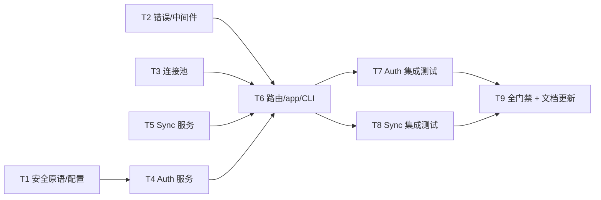

# Implementation Plan — 阶段 2：认证与同步底座

> Header
> - Branch: main
> - Baseline SHA: e60ace7（阶段 2 实现先于本计划落盘——设计先行流程修正；
>   本计划作为对齐/验证/收尾的权威清单，Task 状态如实标注；提交区间见 release.md 独立提交表）
> - Worktree Path: server/
> - Started At: 2026-07-11
> - Updated At: 2026-07-11
> - Commit Mode: per-task（controller-commits）
> - Effective Execution Mode: 单 agent 顺序执行
> - Ledger Mode: controller-commits
> - Plan Verdict.Status: completed

## Dependency Graph

## Global Acceptance Criteria

- AC5：bootstrap/register/token/注销/撤销全链路 401/409 语义正确（auth 集成测试）
- AC10：轮换、限流 429 + Retry-After、轮换与旧码验证交错不签发（auth 集成测试）
- AC6：双设备 patch 终态 = 全局锁顺序最后成功动作；duplicate 不重复执行；版本单调（sync 集成测试）
- AC12：多页快照、分页期间写入经增量续传、cursor 篡改 400（sync 集成测试）
- 门禁：pnpm lint / typecheck / test:unit / test:integration 全绿

## Tasks

### T1 安全原语与配置 — Status: done

- Depends on: —
- Behavior: HKDF/HMAC/SHA-256、Crockford 家庭码生成/规范化、RFC8785 JCS、签名 cursor、
  Argon2id PHC 封装、bootstrap secret 熵校验 + TZ 校验
- Files: security/crypto.ts、security/passwords.ts、config.ts 及其单元测试
- per-Task AC: 家庭码 12 位且排除 I/L/O/U；cursor 篡改返回 null；PHC 匹配 DB CHECK 正则；
  64-hex/43-b64 通过、占位与重复字符拒绝
- Execution: Status=done；Red N/A（先行实现）；Verify：单元测试绿

### T2 错误 envelope 与中间件 — Status: done

- Depends on: —
- Behavior: 目录驱动的失败 envelope；request-id/body-limit/device-auth/on-error
- Files: errors.ts、middleware/*（request-id、body-limit、device-auth、on-error、context-variables）、utils/validation.ts
- per-Task AC: 401 统一且不泄露 token 状态；schema 失败 400 + details；55P03/57014/08* → 503 SERVICE_BUSY + Retry-After:1
- Execution: Status=done

### T3 生产连接池 — Status: done

- Depends on: —
- Behavior: max 10、connect 2s、statement/lock timeout 5s（startup GUC）
- Files: db/pool.ts
- per-Task AC: 配置值落入 postgres-js Options；typecheck 通过
- Execution: Status=done

### T4 Auth 服务 — Status: done

- Depends on: T1
- Behavior: spec AUTH-1..5（bootstrap 单事务、register CAS、rotate/logout/devices/revoke、限流）
- Files: services/auth/{source-key,throttle,auth-service}.ts
- per-Task AC: 事务外 Argon2 校验 + 行锁复核；限流第 5 次锁定；成功清零同事务
- Execution: Status=done

### T5 Sync 服务 — Status: done

- Depends on: T1
- Behavior: spec SYNC-1..2（快照 watermark/keyset、增量、1MB/limit 截断、逐项 ACK、回执幂等）
- Files: services/sync/{cursor,sync-service}.ts
- per-Task AC: 分页期间写入经增量 cursor 续传；duplicate 不重复执行；异 payload 409
- Execution: Status=done

### T6 路由/app/CLI 接线 — Status: done

- Depends on: T2、T3、T4、T5
- Behavior: /api/v1/auth + /api/v1/sync 挂载、createApp 依赖注入、index 启动 fail-fast、
  cli auth recovery-reset
- Files: routes/{auth,sync,index}.ts、app.ts、index.ts、cli.ts
- per-Task AC: 公开 allowlist 只有 bootstrap/register；其余 401；envelope 形状正确
- Execution: Status=done

### T7 Auth 集成测试（AC5/AC10）— Status: done

- Depends on: T6
- Files: test-support/pg.ts、routes/auth.integration.test.ts
- per-Task AC: 两个容器块覆盖 AUTH-1..5 全部行为（含时钟注入锁过期、hasher 屏障轮换交错）
- Execution: Status=done；Verify：test:integration 全绿（44/44，含 auth 18 例）

### T8 Sync 集成测试（AC6/AC12）— Status: done

- Depends on: T6
- Files: routes/sync.integration.test.ts
- per-Task AC: 快照多页 + 增量续传 + 篡改 400；双设备 patch 终态/版本单调；duplicate；
  rejected 三分支；批内顺序与部分拒绝；异 payload 409
- Execution: Status=done；Verify：sync 集成 15 例全绿

### T9 全门禁 + 文档更新 — Status: done

- Depends on: T1..T8
- Behavior: 四道门禁全绿；roadmap 阶段 2 状态与 AC 勾选；AGENTS.md 阶段表；release.md；active index
- per-Task AC: ①roadmap/AGENTS/release/active index 四处阶段状态与 AC 勾选一致且可追溯
  ②交付物清单（文档/代码文件）与 `git status` 变更集一致，无未提交残留说明
- Execution: Status=done；Verify：四道门禁全绿，文档状态已更新

