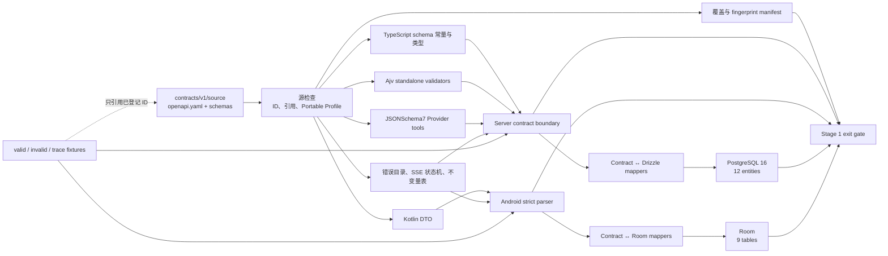

# 阶段 1：契约与持久化

## Context

MealMate Lite v0.1 已经在 `roadmap.md` 和 `brainstorm.md` 中确定 21 个 HTTP operation、8 个 Function Calling 工具、6 种 SSE event、12 个 PostgreSQL 逻辑实体和 9 张 Android 本地表。阶段 0 只交付了运行骨架，阶段 1 必须把这些文字约束转化为后端、AI Provider、数据库和 Android 可共同验证的契约。

原文档把 Zod、Kotlin serializer 和数据库 schema 分别描述为契约载体，会产生重复定义。实际工具验证还发现：

- OpenAPI Generator 7.22.0 的 TypeScript models-only 输出依赖未生成的 runtime，不能作为独立 TypeScript 模型；
- Kotlin nullable 属性会把字段缺失与显式 null 合并，无法实现 `update_recipe.patch` 的“不修改/清空/设值”三态；
- 单对象 schema 无法表达 SSE 跨帧顺序、错误响应 tuple 和跨字段业务不变量；
- AI SDK 的 Provider 输入边界使用 JSONSchema7，不能直接接受不受限的 Draft 2020-12 schema。

因此阶段 1 采用“一个权威源、多个只读投影、协议级验证、显式存储映射”的结构。

## Goal

阶段 1 完成时：

- 契约 manifest 精确覆盖 21 个 HTTP operation、8 个 Function Calling 工具和 6 种 SSE event；
- TypeScript、Provider、Kotlin、错误目录、SSE 状态机和 fixtures 全部从 `contracts/v1/source/` 派生；
- PostgreSQL 16 的 12 个逻辑实体和 Android Room 的 9 张表通过显式 mapper 消费相同 wire DTO；
- 有效/无效 fixture、协议 trace、迁移和确定性生成门禁全部通过；
- 在两个空目录生成的文件路径与字节内容完全一致，且与已提交生成物零差异。

## Non-Goal

- 不生成 Hono server stub、Retrofit client 或业务 service。
- 不实现认证、同步执行器、8 个 FC executor、AI Provider 适配、SSE 路由或 Android 页面业务。
- 不让 PostgreSQL/Drizzle 或 Room 数据模型成为公开 wire contract。
- 不在 v0.1 引入多家庭、多用户或跨部署兼容协议。
- 不承诺 `contracts/v1` 冻结后的新增可选响应字段兼容；严格客户端下任何 wire shape 变化都需要新版本。

## Architecture



### Source layout

```text
contracts/v1/
├── source/
│   ├── openapi.yaml
│   └── schemas/
│       ├── common.schema.json
│       ├── auth.schema.json
│       ├── chat.schema.json
│       ├── recipe.schema.json
│       ├── plan.schema.json
│       ├── sync.schema.json
│       └── settings.schema.json
├── fixtures/
│   ├── valid/
│   ├── invalid/
│   └── traces/
├── generated/
│   ├── manifest.json
│   ├── protocol-catalog.json
│   └── provider-tools.json
└── toolchain.lock.json
```

`source/` 是唯一允许手工修改契约事实的目录。`openapi.yaml` 是根目录，包含 HTTP paths/components，并通过以下扩展引用 `schemas/*.schema.json`：

- `x-mealmate-functions`：8 个工具名称、描述、input/output schema ID；
- `x-mealmate-errors`：错误码、HTTP 状态、retryable、Retry-After policy、允许传输通道；
- `x-mealmate-sse`：事件 schema、状态转换、终止状态、tool lifecycle；
- `x-mealmate-invariants`：稳定不变量 ID、适用 schema、执行责任和 golden vector。

扩展本身由 `contracts/meta/mealmate-contract-meta.schema.json` 校验。生成物只包含投影，不允许反向编辑。

`fixtures/` 是手工维护的测试证据，不是第二事实源：样本只能引用 source 中已存在的 schema/error/invariant ID，不得在 fixture manifest 中重新声明字段、状态转换或错误 tuple。

### Portable Profile

权威 schema 使用 JSON Schema Draft 2020-12，并限定为可无损投影的 MealMate Portable Profile：

- 允许 `type`、`properties`、`required`、`additionalProperties:false`、`items`、`enum`、`const`、`oneOf`、`format`、`pattern`、长度与数量边界；
- 联合分支必须通过稳定判别字段或互斥 const 组合区分；
- 禁止 `dynamicRef`、`recursiveRef`、`unevaluatedProperties`、`contentSchema`、复杂条件 schema；
- 每个公开 object 显式声明 `additionalProperties:false`；
- 每个 schema 具有唯一、稳定、版本化 `$id`；
- Provider 投影必须展开引用并移除元数据，但不能弱化 required、additionalProperties、enum、const、长度、数量或联合语义。

### Consumer boundaries

| 消费方 | 输入 | 产出 | 权威校验 |
|---|---|---|---|
| Server HTTP/FC/JSONB | 2020-12 schema 常量 | `FromSchema` TypeScript 类型 | Ajv 2020 standalone validator |
| AI SDK Provider | FC schema 引用 | 展开的 JSONSchema7 tools | 执行前再次调用 Ajv 权威 validator |
| Android network/sync | OpenAPI schema projection | kotlinx.serialization DTO | strict JSON parser + domain mapper 不变量 |
| PostgreSQL | 已校验 contract DTO/domain command | Drizzle row | DB constraint + mapper |
| Room | 已解析 contract DTO | Room entity | mapper + Room constraint |

Android serializer 不承担 JSON Schema 所有格式和长度关键字的运行时解释；服务端是公开输入的权威 schema 边界。Android 对服务端对象采用 strict parser，并在进入 Room 前执行生成的不变量表和显式 mapper 检查。

TypeScript 生成器为每个公开 schema 输出完全展开、只读的 `as const` 常量，再以 `FromSchema<typeof DereferencedSchema>` 推导类型；权威源仍保留 `$ref`，展开常量只是生成投影。这样避免 `json-schema-to-ts` 在编译期重新解析外部文件引用。

## Interface Contract

### Behavior: 权威契约覆盖

**Source contracts**

```ts
type ContractManifest = {
  contractVersion: 'v1'
  fingerprint: string
  httpOperations: readonly OperationDescriptor[]
  functionTools: readonly FunctionToolDescriptor[]
  sseEvents: readonly SseEventDescriptor[]
  schemas: readonly SchemaDescriptor[]
  errors: readonly PublicErrorDefinition[]
  invariants: readonly InvariantDefinition[]
}

async function compileContractSources(
  sourceRoot: string,
  outputRoot: string,
): Promise<ContractManifest>

async function checkGeneratedContract(
  sourceRoot: string,
  committedOutputRoot: string,
): Promise<GeneratedDiff>
```

错误：

- `CONTRACT_DUPLICATE_ID`
- `CONTRACT_UNRESOLVED_REF`
- `CONTRACT_PROFILE_VIOLATION`
- `CONTRACT_COVERAGE_MISMATCH`
- `CONTRACT_GENERATED_DRIFT`

`fingerprint` 对规范化后的权威源文件集合计算 SHA-256；路径使用 `/`，文本固定 UTF-8/LF，文件按相对路径字典序参与计算。

### Behavior: HTTP JSON 契约

```ts
type ContractValidationResult<T> =
  | { success: true; value: T }
  | { success: false; issues: readonly ContractIssue[] }

function validateContract<TSchemaId extends PublicSchemaId>(
  schemaId: TSchemaId,
  value: unknown,
): ContractValidationResult<ContractType<TSchemaId>>
```

Ajv 2020 配置固定为：

```ts
{
  strict: true,
  allErrors: true,
  coerceTypes: false,
  removeAdditional: false,
  useDefaults: false,
  validateFormats: true
}
```

`ajv-formats` 只启用契约登记的 `uuid`、`date`、`date-time`、`uri`。公开校验失败映射为既有 `BAD_REQUEST` 或 `VALIDATION_ERROR`；内部生成错误阻止启动或 CI。

Android JSON 配置固定为：

```kotlin
Json {
    serializersModule = contractWireFormatSerializers
    ignoreUnknownKeys = false
    isLenient = false
    coerceInputValues = false
    explicitNulls = true
}
```

OpenAPI Generator 会把 `uuid`、`uri`、`date`、`date-time` 分别生成为 `UUID`、`URI`、`LocalDate`、`OffsetDateTime` 的 `@Contextual` 属性。`contractWireFormatSerializers` 必须提供四个固定字符串 serializer：UUID 只接受小写 canonical form；URI 必须为绝对 URI；date 使用 `YYYY-MM-DD`；date-time 使用 UTC RFC 3339，输入 offset 必须为零并统一序列化为 `Z`。解析失败不得退回普通 String。

### Behavior: Function Calling 契约

```ts
type FunctionToolName =
  | 'add_recipe'
  | 'update_recipe'
  | 'delete_recipe'
  | 'restore_recipe'
  | 'search_recipes'
  | 'batch_generate_recipes'
  | 'generate_weekly_plan'
  | 'update_plan_item'

function validateToolInput<TName extends FunctionToolName>(
  toolName: TName,
  input: unknown,
): ContractValidationResult<ToolInput<TName>>
```

未知工具返回内部分类 `UNKNOWN_TOOL`；非法参数映射为工具公共失败 `VALIDATION_ERROR`，不得进入 executor。

### Behavior: 可清空字段三态

`update_recipe.patch.imageUrl` 和 `notes` 改为显式操作：

```ts
type ClearPatch = { op: 'clear' }
type SetImageUrlPatch = { op: 'set'; value: string }
type SetNotesPatch = { op: 'set'; value: string }

type UpdateRecipePatch = {
  name?: string
  tags?: string[]
  ingredients?: string[]
  steps?: string[]
  imageUrl?: ClearPatch | SetImageUrlPatch
  notes?: ClearPatch | SetNotesPatch
}
```

- 字段缺失：不修改；
- `op='clear'`：写入 null；
- `op='set'`：校验 value 后写入；
- patch 至少包含一个字段；
- clear 分支禁止 value，set 分支要求 value。

HTTP `PATCH /api/v1/recipes/:id` 和离线 `recipe.patch` 仍只覆盖 name/tags，不受此变化影响。

### Behavior: Provider 工具投影

```ts
type ProviderToolDefinition = {
  name: FunctionToolName
  description: string
  inputSchema: JsonSchema7
}

function buildProviderTools(
  manifest: ContractManifest,
): readonly ProviderToolDefinition[]

function toAiSdkSchema<TName extends FunctionToolName>(
  toolName: TName,
): FlexibleSchema<ToolInput<TName>>
```

投影流程：

1. 从 manifest 获取工具 input schema ID；
2. 递归展开 `$ref`；
3. 验证所有关键字属于 Portable Profile；
4. 移除 `$schema`、`$id` 和 description 之外的非语义元数据；
5. 输出 JSONSchema7；
6. 将对应 Ajv validator 作为 AI SDK `jsonSchema()` 的 validate 回调。

任何无法无损投影的关键字返回 `CONTRACT_PROVIDER_PROJECTION_UNSAFE` 并使生成失败。

### Behavior: 公共错误目录

```ts
type RetryAfterPolicy =
  | { kind: 'none' }
  | { kind: 'fixed'; seconds: 1 | 5 }
  | { kind: 'range'; minSeconds: number; maxSeconds: number }

type PublicErrorDefinition = {
  errCode: PublicErrorCode
  httpStatus: 400 | 401 | 404 | 409 | 410 | 422 | 429 | 500 | 502 | 503 | 504
  retryable: boolean
  retryAfter: RetryAfterPolicy
  channels: readonly ('json' | 'sse')[]
}

function resolveErrorDefinition(errCode: PublicErrorCode): PublicErrorDefinition

function validatePublicErrorTuple(
  status: number,
  headers: Headers,
  body: unknown,
  channel: 'json' | 'sse',
): ContractValidationResult<PublicErrorEnvelope>
```

错误码不在目录、状态不一致、retryable 不一致、Retry-After 缺失/越界/多余或传输通道不允许时均拒绝构造公开失败。

### Behavior: SSE 事件协议

```ts
type SseFrame = {
  eventId: string
  event:
    | 'start'
    | 'delta'
    | 'tool-status'
    | 'confirmation-required'
    | 'error'
    | 'done'
  data: unknown
}

type TraceValidationResult =
  | { success: true; terminal: 'done' | 'error' }
  | { success: false; frameIndex: number; invariantId: string }

function validateSseTrace(frames: readonly SseFrame[]): TraceValidationResult
```

TS 与 Kotlin 都实现一个通用状态机解释器，消费生成的 transition table；事件顺序事实只存在于 `x-mealmate-sse`。必须检查：

- start 恰好一次且最先；
- done/error 二选一且最后；
- eventId 从 1 开始并严格递增；
- 同一 toolCallId 先 started，随后恰好一次 succeeded/failed；
- pending confirmation 要求 token，terminal confirmation 禁止 token；
- completed replay 与 resumed 不同时为 true。

### Behavior: 语义不变量

```ts
type InvariantId =
  | 'WEEK_START_IS_MONDAY'
  | 'WEEKLY_PLAN_HAS_21_SLOTS'
  | 'SYNC_RESULTS_PRESERVE_INPUT_ORDER'
  | 'SERVER_VERSION_WITHIN_DB_BIGINT'
  | 'CONFIRMATION_STATE_FIELDS_MATCH'

function validateInvariant(
  invariantId: InvariantId,
  value: unknown,
): ContractValidationResult<unknown>
```

每条 `x-mealmate-invariants` 记录：

- `id`：稳定 ID；
- `appliesTo`：schema ID；
- `owners`：server、android、database 中至少一个；
- `vectors`：至少一个 valid 和一个 invalid fixture。

### Behavior: PostgreSQL 首版结构

数据库模块不得导出 wire DTO。映射接口为：

```ts
function recipeRowToContract(row: RecipeRow): RecipeView
function recipeContractToInsert(value: RecipeDraft): NewRecipeRow
function weeklyPlanRowsToContract(plan: WeeklyPlanRow, items: readonly PlanItemRow[]): WeeklyPlanView
function syncChangeRowToContract(row: SyncChangeRow): SyncChangeDto
function validateVersionedJsonb(
  kind: VersionedJsonbKind,
  schemaVersion: number,
  payload: unknown,
): ValidatedJsonbPayload
type SyncResourceLock =
  | { resource: 'recipe' | 'weekly_plan'; id: string }
  | { resource: 'settings'; id: 'familyPreference' }
type SyncWriteContext = {
  tx: Transaction
  nextServerVersion(): Promise<bigint>
}
async function withSyncWriteTransaction<T>(
  db: Database,
  resourceLocks: readonly SyncResourceLock[],
  work: (context: SyncWriteContext) => Promise<T>,
): Promise<T>
async function assertDatabaseSchemaCurrent(db: Database): Promise<void>
```

mapper 输入必须已经通过 contract validator；从数据库读取 JSONB 时再次按 `(kind, schemaVersion)` 验证，其中 SyncChange 的 kind 由 `(resource, operation)` 细分。未知 kind/version 使 readiness 或消费失败。

`withSyncWriteTransaction` 是阶段 1 唯一允许创建同步版本的基础设施入口：先取得固定 advisory transaction lock，再把已有目标资源按 `(resource,id)` 排序并锁行，然后才进入回调。新建资源没有可锁行，由全局锁和唯一约束保护。sequence 访问保持在该模块内部；回调只能通过 `nextServerVersion()` 按需取得一个或多个版本，以支持批量写入多个 SyncChange。回调中的业务数据、SyncChange 和对应 receipt 只能一起提交或一起回滚。阶段 1 只交付该事务原语和集成证据，不提前实现阶段 2 领域服务。`assertDatabaseSchemaCurrent` 对迁移 journal、数据库已应用版本和所有已知 JSONB schema version 做启动检查；任何不一致都令 readiness 返回 `503 NOT_READY`。

### Behavior: Android Room 本地结构

```kotlin
interface ContractRoomMapper<Contract : Any, Entity : Any> {
    fun toEntity(contract: Contract): Entity
    fun toContract(entity: Entity): Contract
}

suspend fun applySyncPage(
    page: SyncPageDto,
    currentCursor: String?,
): SyncApplyResult

fun decodePendingActionPayload(
    schemaVersion: Int,
    payloadJson: String,
): PendingActionPayloadDto

fun decodeAuthoritativeSnapshot(
    schemaVersion: Int,
    authoritativeJson: String,
): SyncAuthoritativeSnapshotDto
```

`applySyncPage` 在一个 Room transaction 内完成 schema/invariant 检查、聚合替换、墓碑处理和 cursor 推进。任何失败回滚整页。两个 decode 接口先按生成的版本目录拒绝未知 schema version，再使用 strict Kotlin DTO parser；不得根据当前 App 版本猜测持久化联合的结构。pending action 只接受 strict DTO 的 canonical JSON 与其 SHA-256，保存读取后 actionId、payload、payloadHash 和 pending state 必须逐项不变。

### Behavior: 确定性生成与冻结

生成环境固定：

| 项目 | 固定值 |
|---|---|
| Node.js | 24.18.0 |
| TypeScript | 7.0.2 |
| pnpm | 11.17.0 |
| Ajv | 8.20.0 |
| ajv-formats | 3.0.1 |
| json-schema-to-ts | 3.1.1 |
| OpenAPI Generator | 7.22.0 |
| OpenAPI Generator JAR SHA-256 | `3f1e6ce5c6ad4f15242c6170ab43aad4bad771622617eeece4a7d4f72ffaf329` |
| JDK | Temurin 21.0.7+6 |
| Kotlin | 2.4.10 |
| kotlinx.serialization | 1.11.0 |
| Locale / timezone / newline | `C.UTF-8` / `UTC` / LF |

`contract:generate` 必须先生成到空临时目录，再原子同步到目标目录；`contract:check` 在另一个空目录生成并递归比较路径、内容和陈旧文件。禁止在现有生成目录上原地覆盖后只比较已知文件。

Kotlin 生成固定使用上述官方 CLI JAR。`app/scripts/generate-contract-models.sh --output-dir <empty-dir>` 下载到 `app/build/contract-tools/`，校验 SHA-256 后才执行，且只写显式输出目录；Gradle 的 `generateContractModels` task 调用该脚本生成到 staging，成功后才原子同步 committed source，不再引入另一个 OpenAPI Generator plugin artifact。另设非变更型 `checkContractModels` task：调用 `app/scripts/check-contract-models.sh`，由后者以独立空目录调用同一生成脚本，递归比较路径与字节，并检查 committed 目录中的陈旧文件；检查任务不得先改写工作区，因而能真实发现 stale DTO。

Drizzle 的第一版 migration 也使用独立 staging wrapper。`migration-lock.json` 固定 tag 和审计用 ISO `journalWhen`（首版固定 `2026-07-26T00:00:00.000Z`）；wrapper 从空目录生成后，将该值以 `Date.parse(journalWhen)` 转为 epoch milliseconds，并把 `_journal.json.entries[].when` 规范化为 number `1785024000000`，不得写成 ISO string。snapshot 顶层随机 `id` 也规范化：移除 `id/prevId` 后递归排序 object key、使用 UTF-8/LF 和无多余空白序列化，计算 SHA-256，取前 16 bytes 并设置 version nibble=8、RFC 4122 variant，格式化为稳定 UUID；首版保持 `prevId=""`。完整 artifacts 随后写入同一文件系统的不可变 `.migrations-releases/<release>`；仅在 staging、规范化和复制均成功后，以一次 POSIX `rename` 原子替换 `migrations` 相对 symlink。每次 migration runtime 先解析该指针一次，再把所得物理 release 路径交给 Drizzle，因此已启动的读取保持在完整旧 release，新的读取只会看到完整旧或新 release。发布不删除旧 release；GC 必须在确认无读者后显式执行。SQL 字节、规范化 snapshot、规范化 journal 和生成路径集合随后与 committed artifacts 精确比较。`db:migrations:check` 只读 committed release，不在原目录执行 generate；篡改 SQL、schema 内容、tag、journal 语义或 snapshot 语义都必须失败。

## Data Model

### 契约元数据

| 结构 | 字段 | 约束 |
|---|---|---|
| SchemaDescriptor | id、file、dialect、public | id 唯一；dialect 固定 2020-12 |
| OperationDescriptor | operationId、method、path、requestSchemaId、response schema/status map | operationId 唯一；method/path 唯一组合 |
| FunctionToolDescriptor | name、description、inputSchemaId、outputSchemaId | name 恰好属于 8 个 v0.1 工具 |
| SseEventDescriptor | event、schemaId、start/terminal flags | event 恰好属于 6 个事件 |
| PublicErrorDefinition | errCode、status、retryable、retryAfter、channels | errCode 唯一；tuple 唯一 |
| InvariantDefinition | id、appliesTo、owners、vectors | 每项至少 1 valid + 1 invalid vector |
| ContractManifest | version、fingerprint、上述目录 | count 必须为 21/8/6 |

### PostgreSQL 16

| 实体 | 主键/唯一 | 关键关系与约束 |
|---|---|---|
| Recipe | id；server_version UNIQUE | name 1..100；软删除；数组非 null |
| WeeklyPlan | id；week_start UNIQUE；server_version UNIQUE | week_start 为周一 |
| PlanItem | id；(weekly_plan_id,date,meal_type) UNIQUE | plan CASCADE；recipe RESTRICT；完整 21 餐 |
| Conversation | device_id | DeviceToken RESTRICT；最多 40 条消息 |
| Settings | key；server_version UNIQUE | v0.1 仅 familyPreference |
| AuthConfig | singleton=true | 全库最多一行；Argon2id hash |
| DeviceToken | id；token_hash UNIQUE | 撤销不物理删除 |
| PendingConfirmation | id；token_hash UNIQUE；(device_id,chat_request_id,tool_index) UNIQUE | device/chat receipt RESTRICT；10 分钟 |
| ChatRequestReceipt | (device_id,chat_request_id) | 30 秒租约；generation fencing |
| SyncActionReceipt | (device_id,action_id) | status=applied/rejected |
| SyncChange | server_version | 永久变更流；payload schema version |
| AuthAttemptThrottle | (scope,source_key_hash) | failure_count、locked_until 原子更新 |

所有同步写事务固定遵守“全局 advisory lock → 资源行锁 → 分配 serverVersion → 业务数据/SyncChange/receipt 同事务提交”。

所有 JSONB 都有相邻的 schema version carrier，不能靠表名或当前代码版本猜测其结构：

| JSONB carrier | 版本列 | 约束 |
|---|---|---|
| Conversation.messages | messages_schema_version | 非空且 `>= 1` |
| Settings.value | value_schema_version | 非空且 `>= 1` |
| PendingConfirmation.draft_payload | draft_schema_version | 非空且 `>= 1` |
| PendingConfirmation.result | result_schema_version | 两列同时为空或同时非空；非空时 `>= 1` |
| ChatRequestReceipt.tool_receipts | tool_receipts_schema_version | 两列同时为空或同时非空；非空时 `>= 1` |
| SyncActionReceipt.result | result_schema_version | 非空且 `>= 1` |
| SyncChange.payload | payload_schema_version | 非空且 `>= 1`；validator kind 由 resource/operation 决定 |

上述配对和范围均落数据库 CHECK。每个 `(kind, schemaVersion)` 只能解析为一个权威 schema；migration 集成测试必须枚举全部 carrier，证明不存在无版本 JSONB。

### Android Room

| 表 | 主键/唯一 | 关键约束 |
|---|---|---|
| recipes | id | server_version 为十进制 String；保留 tombstone |
| weekly_plans | id；week_start UNIQUE | 聚合头 |
| plan_items | id；(weekly_plan_id,date,meal_type) UNIQUE | 随完整计划替换 |
| settings_cache | key | 仅服务端已确认值 |
| conversation_messages | 本地顺序 | 最多 40 条 |
| pending_actions | action_id | 仅 recipe.patch/delete；pending/sending/failed |
| sync_failures | action_id | authoritative 或 full-resync 标记 |
| sync_state | singleton | cursor 只在整页成功后推进 |
| chat_draft | singleton | 仅未发送文本，不含 token |

Room 中有两个持久化判别联合，必须携带相邻版本：

| Room carrier | 版本列 | 约束 |
|---|---|---|
| pending_actions.payload_json | payload_schema_version | 非空且 `>= 1`；v0.1 只允许 recipe.patch/delete envelope |
| sync_failures.authoritative_json | authoritative_schema_version | 两列同时为空或同时非空；非空时 `>= 1` |

读取时先按 `(kind,schemaVersion)` 选择生成的 Kotlin DTO/serializer，再执行不变量检查。Room schema test 必须枚举这两个 carrier；实体构造与唯一 DAO 写入口强制版本范围和 nullable 配对，未知版本不得进入重试或回滚逻辑。

## Error Handling

| 失败点 | 策略 |
|---|---|
| 权威源 YAML/JSON 无法解析 | 生成立即失败，报告文件、JSON Pointer 和原因 |
| schema 引用悬空或循环无法展开 | 生成失败；不保留部分生成物 |
| 使用 Portable Profile 禁止关键字 | 生成失败并报告 schema ID/keyword |
| Provider 投影弱化语义 | 生成失败；禁止把弱化 schema 交给 AI SDK |
| OpenAPI Generator 生成失败或输出不可编译 | Kotlin 门禁失败；保留旧提交生成物，不覆盖 |
| Ajv standalone 编译失败 | Server typecheck/contract test 失败 |
| Kotlin strict parser 无法表达联合 | hardest-shape spike 失败；先调整 wire schema，不写手工影子 DTO |
| Kotlin 缺少 UUID/URI/date/date-time contextual serializer | Android contract test 和启动检查失败；不得以宽松解析或 String fallback 绕过 |
| fixture manifest 缺消费者 | 门禁失败并列出未消费 fixture |
| PostgreSQL 不可连接或 migration 不匹配 | readiness 为 503 NOT_READY |
| JSONB payload schema version 未知 | readiness/消费失败，不解释为业务操作 |
| Room 整页事务失败 | 回滚实体与 cursor，下一次可重复应用同一页 |
| 生成输出漂移或残留陈旧文件 | CI 失败并列出新增、修改、删除路径 |

生成器不自动重试语义错误。依赖下载由 pnpm/Gradle 的既有缓存与重试负责；校验和不一致时立即失败，不降级到其它版本。

## Non-Functional Requirements

| 维度 | 指标 |
|---|---|
| 覆盖 | manifest 精确为 21 HTTP、8 FC、6 SSE；每个 schema/fixture 至少被一个消费者测试使用 |
| 确定性 | 两个空目录生成的路径和内容 100% 相同；与 Git 生成物零差异 |
| 校验安全 | unknown field、类型转换、默认值注入和多余字段删除全部关闭 |
| 数值精度 | `serverVersion` 端到端保持字符串；上限 `9223372036854775807` |
| 页面/批次 | JSON body 和同步页 ≤1 MB；sync actions/limit ≤100 |
| Android | minSdk 26、target/compileSdk 37、JDK 21、Kotlin 2.4.10 |
| 数据库 | PostgreSQL 16；所有 migration 从空库运行并可在已迁移库重复检查 |
| 敏感数据 | fixture 只允许明显合成 token；真实 token、家庭码、bootstrap secret 和模型凭据扫描结果为 0 |
| 冻结 | 阶段 1 退出后 `contracts/v1` wire shape 零变更；变化必须创建新版本 |

## Alternatives Considered

| 方案 | 优点 | 缺点 | 不选原因 |
|---|---|---|---|
| Zod 是后端权威，手写 Kotlin DTO | 后端开发直接 | 字段和联合在两端重复，无法证明一致 | 违反统一唯一事实源 |
| OpenAPI Generator 同时生成 TS/Kotlin | 工具数量少 | TS models-only 实测引用缺失 runtime；OAS 3.1 oneOf 风险高 | TypeScript 生成不可独立编译 |
| JSON Schema 全部直接交给 Provider | 无投影代码 | AI SDK/Provider 使用 JSONSchema7 子集，可能拒绝或忽略 2020-12 关键字 | 会静默弱化 FC 校验 |
| nullable PATCH 依赖缺失/null 区分 | wire 简短 | Kotlin 生成模型把缺失与 null 合并 | 无法实现清空语义 |
| 生成 Retrofit/Hono stub | 路由表面一致 | 阶段 1 范围扩大，生成代码侵入业务层 | 只生成 operation manifest，后续实现绑定测试 |
| PostgreSQL/Room 直接复用 wire model | mapper 少 | 存储演进与公开契约耦合，难以表达 tombstone/本地状态 | 使用显式 mapper 保持边界 |

## Testing Strategy

| 测试对象 | 层级 | 验证方法 | 通过标准 |
|---|---|---|---|
| 权威契约覆盖 | 单元+生成集成 | source lint、引用解析、manifest snapshot | 21/8/6 且无重复/悬空 ID |
| HTTP JSON 契约 | Server/Android 单元 | fixture 按 manifest 声明 consumer；全部 success fixture 解析后重序列化并做 canonical JSON 比较；Android 覆盖 wire shape/union/format/invariant，Server 覆盖全部 schema keyword | 每个声明 consumer 对 valid/invalid 产生预期分类，未消费样本为 0；字段、判别值和数值/字符串表示不漂移 |
| Function Calling 契约 | Server 单元 | 8 工具最小/最大/非法参数 fixtures | 工具集合和边界精确匹配 |
| 可清空字段三态 | Server+Android 单元 | missing/clear/set 三组 golden vectors | 三种结果互不合并 |
| Provider 工具投影 | 单元 | 展开后 schema 与权威 valid/invalid corpus 对跑 | 8 工具语义等价，危险关键字使生成失败 |
| 公共错误目录 | 单元+HTTP 集成 | 每个 errCode 的 status/retryable/header/body tuple | 所有登记 tuple 通过，变体均拒绝 |
| SSE 事件协议 | TS/Kotlin 单元 | valid/invalid trace corpus | 顺序、eventId、tool lifecycle、terminal 全覆盖 |
| 语义不变量 | 单元 | 每个 invariant 的 valid/invalid vectors | 每项至少 1 正 1 反且 ID 稳定 |
| PostgreSQL 首版结构 | Testcontainers 集成 | 空库 migration、重复检查、约束/事务回滚 | 12 实体及约束通过，零部分提交 |
| Android Room 结构 | JVM/instrumented 集成 | in-memory Room 整页 apply/rollback；pending action 四元组 round-trip；排除 `android_metadata`、`room_master_table` 和 `sqlite_%` 后比较业务表名集合 | 9 张业务表精确匹配；actionId/payload/hash/state 不变；聚合和 cursor 同事务 |
| 确定性生成 | 构建门禁 | 两个空目录生成 + recursive diff + stale-file case；Drizzle 从空 staging 规范化后比较 | 契约投影字节相同、migration 语义/规范化字节相同、陈旧或篡改文件被发现 |
| 敏感 fixture | 静态扫描 | 扫描 fixtures/generated | 真实 secret 模式命中 0 |

目标命令：

```bash
mise exec -- corepack pnpm --dir server contract:check
mise exec -- corepack pnpm --dir server typecheck
mise exec -- corepack pnpm --dir server test:unit
mise exec -- corepack pnpm --dir server test:integration
DB_PASSWORD=contract_generation mise exec -- corepack pnpm --dir server db:migrations:check
mise exec -- ./app/gradlew -p app :app:checkContractModels :app:testDebugUnitTest
bash app/scripts/test-check-contract-models.sh
mise exec -- ./app/gradlew -p app :app:connectedDebugAndroidTest
git diff --exit-code -- contracts/v1/generated server/src/contracts/generated app/app/src/main/java/io/yggdrasil/labs/mealmate/lite/contract/generated
```

## Milestones

| 阶段 | 产出 | 依赖 |
|---|---|---|
| M1 权威源与工具链 | source、meta-schema、toolchain lock、manifest | 已确认 v0.1 文档 |
| M2 消费者投影 | TS/Ajv、Provider、Kotlin、protocol tables | M1 |
| M3 持久化 | PostgreSQL migration/mappers、Room entities/mappers | M2 |
| M4 跨端门禁 | fixture corpus、trace、error tuple、deterministic generation | M2、M3 |
| M5 v1 冻结 | 全部门禁通过、文档一致、manifest fingerprint 固定 | M4 |
