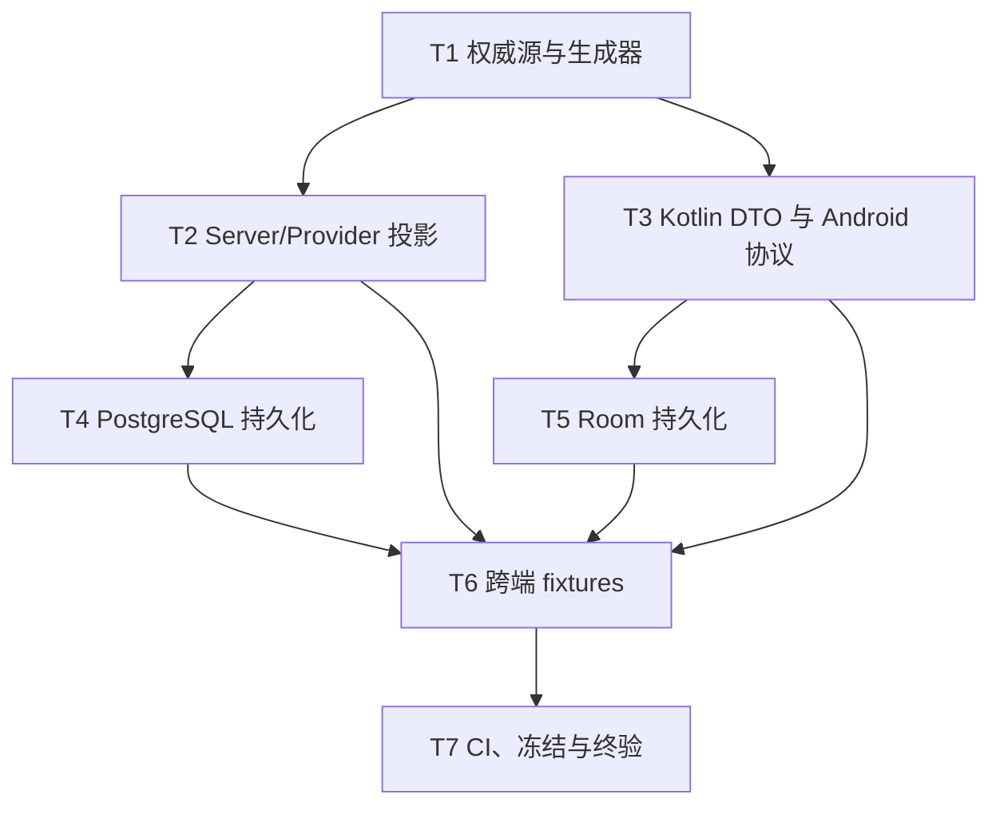

# 阶段 1：契约与持久化

- **Branch:** feature/mealmate_0.1.0
- **Baseline SHA:** c10eb870c979724125456f9128adc6db8e987898
- **Worktree Path:** /home/yangyang/workspace/codes/Yggdrasil-Labs/mealmate-project/mealmate-lite
- **Started At:** 2026-07-26T17:30:00+08:00
- **Updated At:** 2026-08-13T00:40:53+08:00
- **Goal:** 从唯一权威源生成并验证 v0.1 跨端契约，建立 PostgreSQL 12 实体、Room 9 表及显式 mapper，通过阶段 1 全部门禁。
- **Architecture:** `contracts/v1/source/` 唯一定义 wire schema 和协议目录，生成 TS/Ajv、Provider JSONSchema7、Kotlin DTO、错误/SSE/不变量表。Drizzle 与 Room 保持独立，只通过显式 mapper 消费生成 DTO。
- **Tech Stack:** Node.js 24.18.0、TypeScript 7.0.2、Ajv 8.20.0、json-schema-to-ts 3.1.1、OpenAPI Generator 7.22.0、Kotlin 2.4.10、Room 2.8.4、Drizzle 0.45.2、PostgreSQL 16
- **Commit Mode:** per-task
- **Batch Commit Tasks:** null
- **Batch Commit Reason:** null
- **Effective Execution Mode:** per-task
- **Final Record Mode:** terminal-exception

## Global Constraints

- Node.js 固定 24.18.0、pnpm 固定 11.17.0、TypeScript 固定 7.0.2。
- JDK 固定 Temurin 21.0.7+6、Kotlin 固定 2.4.10、kotlinx.serialization 固定 1.11.0。
- PostgreSQL 固定 16；Android minSdk 26、compileSdk/targetSdk 37。
- 权威契约只允许手工修改 `contracts/v1/source/` 和 `contracts/meta/`；生成物禁止手改。
- manifest 必须精确覆盖 21 HTTP、8 FC、6 SSE。
- 公开 object 全部拒绝未知字段；校验禁止类型转换、默认值注入和删除额外字段。
- `serverVersion` 在线格式和 Room 中均为正整数十进制 String；数据库值不超过 `9223372036854775807`。
- JSON body 和单个同步页不超过 1 MB；sync actions/limit 最大 100。
- 真实 token、家庭码、bootstrap secret、模型凭据不得进入 fixture、生成物或日志。
- 阶段 1 不实现 Hono 业务路由、Retrofit client、认证、同步执行器、FC executor、AI Provider 适配或页面业务。
- 每个 task 默认只提交自身声明文件；禁止提交其它工作区改动。
- start-execution 从本计划 Header 读取 Baseline SHA，并导出为 `MEALMATE_BASELINE_SHA` 供 Final Gate 命令使用。
- 每个 task 提交后将实际 SHA 导出为 `TASK_COMMIT_SHA`，供 commit ownership 检查使用。

## Dependency Graph



| Task | 依赖 | 可并行组 |
|---|---|---|
| T1 | 无 | A |
| T2 | T1 | B |
| T3 | T1 | B |
| T4 | T2 | C |
| T5 | T3 | C |
| T6 | T2、T3、T4、T5 | D |
| T7 | T6 | E |

> 可并行组：同组内 Task 互不依赖，可由 subagent 并行执行。

---

### T1: 权威契约源与确定性生成器

**Depends on:** 无

**Files:**

- Create: `contracts/meta/mealmate-contract-meta.schema.json`
- Create: `contracts/v1/source/openapi.yaml`
- Create: `contracts/v1/source/schemas/common.schema.json`
- Create: `contracts/v1/source/schemas/auth.schema.json`
- Create: `contracts/v1/source/schemas/chat.schema.json`
- Create: `contracts/v1/source/schemas/recipe.schema.json`
- Create: `contracts/v1/source/schemas/plan.schema.json`
- Create: `contracts/v1/source/schemas/sync.schema.json`
- Create: `contracts/v1/source/schemas/settings.schema.json`
- Create: `contracts/v1/toolchain.lock.json`
- Create: `contracts/v1/generated/manifest.json`
- Create: `contracts/v1/generated/protocol-catalog.json`
- Create: `server/scripts/contracts/compile.ts`
- Create: `server/scripts/contracts/check.ts`
- Create: `server/src/contracts/types.ts`
- Create: `server/src/contracts/source-compiler.test.ts`
- Modify: `server/package.json`
- Modify: `pnpm-lock.yaml`

**Interfaces:**

- Consumes: none
- Produces: `compileContractSources(sourceRoot: string, outputRoot: string): Promise<ContractManifest>`
- Produces: `checkGeneratedContract(sourceRoot: string, committedOutputRoot: string): Promise<GeneratedDiff>`

**Behavior:**

建立唯一权威源、Portable Profile 和 `x-mealmate-*` 元数据校验。生成器必须在空目录解析所有引用、生成规范化 manifest/fingerprint，并能发现重复 ID、覆盖数量错误、危险关键字和陈旧生成文件。

本 task 必须写入的公开 inventory：

- HTTP：`GET /health/live`、`GET /health/ready`、`POST /api/v1/chat`、`GET /api/v1/chat/history`、`GET /api/v1/recipes`、`PATCH /api/v1/recipes/:id`、`DELETE /api/v1/recipes/:id`、`GET /api/v1/plans/current`、`GET /api/v1/plans/:weekStart`、`GET /api/v1/settings`、`PUT /api/v1/settings`、`GET /api/v1/models`、`POST /api/v1/auth/bootstrap`、`POST /api/v1/auth/register`、`POST /api/v1/auth/logout`、`GET /api/v1/auth/devices`、`DELETE /api/v1/auth/devices/:id`、`POST /api/v1/auth/family-code/rotate`、`POST /api/v1/confirmations/commit`、`GET /api/v1/sync`、`POST /api/v1/sync/actions`；
- FC：`add_recipe`、`update_recipe`、`delete_recipe`、`restore_recipe`、`search_recipes`、`batch_generate_recipes`、`generate_weekly_plan`、`update_plan_item`；
- SSE：`start`、`delta`、`tool-status`、`confirmation-required`、`error`、`done`；
- errors：`BAD_REQUEST`、`INVALID_CURSOR`、`UNAUTHORIZED`、`INVALID_BOOTSTRAP_SECRET`、`INVALID_FAMILY_CODE`、`RECIPE_NOT_FOUND`、`PLAN_NOT_FOUND`、`DEVICE_NOT_FOUND`、`CONFIRMATION_NOT_FOUND`、`CHAT_REQUEST_EXPIRED`、`CONFIRMATION_EXPIRED`、`ALREADY_INITIALIZED`、`NOT_INITIALIZED`、`IDEMPOTENCY_KEY_REUSED`、`RECIPE_DELETED`、`CHAT_REQUEST_SUPERSEDED`、`CONFIRMATION_CONSUMED`、`CONFIRMATION_SUPERSEDED`、`CONFIRMATION_STALE`、`RECIPE_IN_USE`、`CHAT_IN_PROGRESS`、`CHAT_DEVICE_BUSY`、`VALIDATION_ERROR`、`INVALID_WEEK_START`、`MODEL_UNAVAILABLE`、`NO_NEW_RECIPES`、`RATE_LIMITED`、`INTERNAL_ERROR`、`SYNC_CHANGE_TOO_LARGE`、`PROVIDER_ERROR`、`NOT_READY`、`SERVICE_BUSY`、`MODEL_TIMEOUT`；
- invariants：`WEEK_START_IS_MONDAY`、`WEEKLY_PLAN_HAS_21_SLOTS`、`SYNC_RESULTS_PRESERVE_INPUT_ORDER`、`SERVER_VERSION_WITHIN_DB_BIGINT`、`CONFIRMATION_STATE_FIELDS_MATCH`。

**Acceptance Criteria:**

- [x] `manifest.json` 精确包含 21 HTTP、8 FC、6 SSE，所有 schema/error/invariant ID 唯一且引用可解析。
- [x] 两个空目录生成结果字节相同；注入重复 ID、禁止关键字或陈旧文件时测试分别失败并返回稳定错误分类。

**Execution:**

- **Status:** done
- **Commit SHA:** cb74cdea3959c4d650766a23a20204c92e367bf9
- **Corrective Commit SHA:** 6a642405c524b25d8a53d5b4a8b1d3afcc049351
- **Attempts:** 2
- **Blocked Reason:** null
- **Red Result:** FAIL → PASS (2026-07-28) — HTTP request/response schema binding、元数据 vector、确定性排序与跨根引用反例均被新增回归测试覆盖。
- **Verify Result:** PASS (2026-07-28) — `contract:generate`、`typecheck`、`test:unit`（90 tests）和 `contract:check` 全部通过；manifest 为 21 HTTP / 8 FC / 6 SSE。
- **AC Result:** 2/2 passed after independent re-review

**Task Completion Gate:**

- [x] Red Result exists and passed
- [x] Verify Result exists and passed
- [x] AC Result: null (task AC declares no per-task AC) OR (total > 0 AND pass + deferred.length == total, non-deferred AC all verified)
- [x] Commit SHA belongs to this task only
- [x] Per-task AC checkbox synced

**Step 1: Red**

编写 `source-compiler.test.ts`，先断言：

```ts
expect(manifest.httpOperations).toHaveLength(21)
expect(manifest.functionTools).toHaveLength(8)
expect(manifest.sseEvents).toHaveLength(6)
expect(secondTree).toEqual(firstTree)
expect(staleFileCheck.code).toBe('CONTRACT_GENERATED_DRIFT')
```

Run:

```bash
mise exec -- corepack pnpm --dir server vitest run src/contracts/source-compiler.test.ts
```

Expected: **FAIL** — compiler、source 和 manifest 尚不存在。

**Step 2: Green**

- 锁定 `ajv@8.20.0`、`ajv-formats@3.0.1`、`json-schema-to-ts@3.1.1`、`yaml@2.9.0`；
- 实现 UTF-8/LF、相对路径字典序和 SHA-256 fingerprint；
- 只接受 Portable Profile；
- 生成到 `mkdtemp` 空目录，再完整比较目标树；
- 在 `server/package.json` 增加 `contract:generate` 和 `contract:check`。

**Step 3: Verify**

Run:

```bash
mise exec -- corepack pnpm --dir server vitest run src/contracts/source-compiler.test.ts
mise exec -- corepack pnpm --dir server contract:check
```

Expected: **PASS** — 覆盖、引用、profile、determinism 和 stale-file cases 全部通过。

**AC Verification:**

- AC1: 读取生成 manifest 的三个数组长度 → `21/8/6`
- AC2: 对两个 temp tree 执行递归 SHA-256 比较并执行 stale fixture → 相同树通过、陈旧文件失败

**Step 4: Commit**

格式：`feat(contract): 建立 v1 契约唯一事实源`。只提交 T1 Files；用 `git diff-tree --no-commit-id --name-only -r "$TASK_COMMIT_SHA"` 验证归属。

---

### T2: Server、Provider、错误与 SSE 投影

**Depends on:** T1

**Files:**

- Create: `server/src/contracts/generated/schemas.ts`
- Create: `server/src/contracts/generated/validators.ts`
- Create: `server/src/contracts/generated/catalogs.ts`
- Create: `contracts/v1/generated/provider-tools.json`
- Create: `server/src/contracts/validation.ts`
- Create: `server/src/contracts/provider-tools.ts`
- Create: `server/src/contracts/error-catalog.ts`
- Create: `server/src/contracts/sse-trace.ts`
- Create: `server/src/contracts/invariants.ts`
- Create: `server/src/contracts/validation.test.ts`
- Create: `server/src/contracts/provider-tools.test.ts`
- Create: `server/src/contracts/protocols.test.ts`
- Modify: `server/scripts/contracts/compile.ts`
- Modify: `server/src/utils/validation.ts`
- Modify: `server/package.json`
- Modify: `pnpm-lock.yaml`

**Interfaces:**

- Consumes: `compileContractSources(sourceRoot: string, outputRoot: string): Promise<ContractManifest>` from T1
- Produces: `validateContract<TSchemaId extends PublicSchemaId>(schemaId: TSchemaId, value: unknown): ContractValidationResult<ContractType<TSchemaId>>`
- Produces: `validateToolInput<TName extends FunctionToolName>(toolName: TName, input: unknown): ContractValidationResult<ToolInput<TName>>`
- Produces: `buildProviderTools(manifest: ContractManifest): readonly ProviderToolDefinition[]`
- Produces: `resolveErrorDefinition(errCode: PublicErrorCode): PublicErrorDefinition`
- Produces: `validatePublicErrorTuple(status: number, headers: Headers, body: unknown, channel: 'json' | 'sse'): ContractValidationResult<PublicErrorEnvelope>`
- Produces: `validateSseTrace(frames: readonly SseFrame[]): TraceValidationResult`
- Produces: `validateInvariant(invariantId: InvariantId, value: unknown): ContractValidationResult<unknown>`

**Behavior:**

从权威源生成 TypeScript schema 常量、FromSchema 类型、Ajv standalone validators、Provider JSONSchema7 和协议目录。工具执行前始终重新调用权威 validator；错误 tuple 和 SSE trace 由生成目录驱动。

**Acceptance Criteria:**

- [x] 8 个 Provider 工具与权威 valid/invalid corpus 语义等价，无法无损投影时返回 `CONTRACT_PROVIDER_PROJECTION_UNSAFE`。
- [x] Ajv 禁止 unknown/coercion/default/removal；错误 tuple、eventId、terminal 和 tool lifecycle 的正反测试全部通过。

**Execution:**

- **Status:** done
- **Commit SHA:** ae5f0bdd267a9ccd3a672f99b1ee48291b9d4101
- **Corrective Commit SHA:** 3b8c6a1cc9164a26a9439c9416c5a0e6a80eae23
- **Attempts:** 2
- **Blocked Reason:** null
- **Red Result:** FAIL → PASS (2026-07-28) — SSE error schema/catalog、Provider 执行前权威校验与共享 invariant corpus 的反例均先失败后通过。
- **Verify Result:** PASS (2026-07-28) — `contract:generate`、`typecheck`、`test:unit`（90 tests）、`contract:check` 和 Biome lint 全部通过。
- **AC Result:** 2/2 passed after independent re-review

**Task Completion Gate:**

- [x] Red Result exists and passed
- [x] Verify Result exists and passed
- [x] AC Result: null (task AC declares no per-task AC) OR (total > 0 AND pass + deferred.length == total, non-deferred AC all verified)
- [x] Commit SHA belongs to this task only
- [x] Per-task AC checkbox synced

**Step 1: Red**

先写测试断言：

```ts
expect(validateToolInput('update_recipe', missingNotes).success).toBe(true)
expect(validateToolInput('update_recipe', clearNotes).value.patch.notes.op).toBe('clear')
expect(buildProviderTools(manifest)).toHaveLength(8)
expect(validateSseTrace(validTrace).success).toBe(true)
expect(validateSseTrace(nonMonotonicTrace).success).toBe(false)
expect(validatePublicErrorTuple(429, headers, body, 'json').success).toBe(true)
```

Run:

```bash
mise exec -- corepack pnpm --dir server vitest run src/contracts/validation.test.ts src/contracts/provider-tools.test.ts src/contracts/protocols.test.ts
```

Expected: **FAIL** — 生成 TS、validators 和 protocol runtime 尚不存在。

**Step 2: Green**

- 为每个公开 schema 生成完全展开的 `as const` 常量，并以 `FromSchema<typeof DereferencedSchema>` 推导类型；
- 使用 Ajv 2020 standalone 生成纯 ESM validator；
- Provider 投影展开 `$ref`，遇到危险关键字立即失败；
- 使用 AI SDK `jsonSchema()` 的 validate callback 连接权威 validator；
- 以生成目录实现错误 tuple、SSE 状态机和 invariant dispatcher；
- 删除 `@hono/zod-validator` 与直接 `zod` 依赖；把 `utils/validation.ts` 改为 Ajv/Hono 结构化错误适配器。

**Step 3: Verify**

Run:

```bash
mise exec -- corepack pnpm --dir server contract:generate
mise exec -- corepack pnpm --dir server typecheck
mise exec -- corepack pnpm --dir server vitest run src/contracts/validation.test.ts src/contracts/provider-tools.test.ts src/contracts/protocols.test.ts
```

Expected: **PASS**。

**AC Verification:**

- AC1: 对 8 个 tool input schema 执行相同 valid/invalid corpus → 结果逐项相同
- AC2: 运行 protocol tests → coercion/unknown/default、错误 tuple、SSE 顺序和 tool lifecycle 反例全部拒绝

**Step 4: Commit**

格式：`feat(server): 生成并接入权威契约校验`。只提交 T2 Files 和由 T2 生成的 server files。

---

### T3: Kotlin DTO、严格解析与 Android 协议验证

**Depends on:** T1

**Files:**

- Create: `contracts/v1/kotlin-generator-config.yaml`
- Create: `app/scripts/generate-contract-models.sh`
- Create: `app/scripts/check-contract-models.sh`
- Create: `app/scripts/test-check-contract-models.sh`
- Create: `app/app/src/main/java/io/yggdrasil/labs/mealmate/lite/contract/ContractJson.kt`
- Create: `app/app/src/main/java/io/yggdrasil/labs/mealmate/lite/contract/WireFormatSerializers.kt`
- Create: `app/app/src/main/java/io/yggdrasil/labs/mealmate/lite/contract/ProtocolValidators.kt`
- Create: `app/app/src/main/java/io/yggdrasil/labs/mealmate/lite/contract/generated/`
- Create: `app/app/src/test/java/io/yggdrasil/labs/mealmate/lite/contract/GeneratedContractTest.kt`
- Create: `app/app/src/test/java/io/yggdrasil/labs/mealmate/lite/contract/ProtocolValidatorsTest.kt`
- Modify: `app/app/build.gradle.kts`

**Interfaces:**

- Consumes: `contracts/v1/source/openapi.yaml`、`contracts/v1/generated/manifest.json`、`contracts/v1/generated/protocol-catalog.json` from T1
- Produces: `val contractJson: Json`
- Produces: `val contractWireFormatSerializers: SerializersModule`
- Produces: `fun validateSseTrace(frames: List<SseFrameDto>): TraceValidationResult`
- Produces: `fun validateInvariant(invariantId: InvariantId, value: Any): ContractValidationResult`

**Behavior:**

固定 OpenAPI Generator 7.22.0 只生成 Kotlin DTO，不生成 Retrofit API。所有公开联合使用 strict kotlinx.serialization 解析；missing/clear/set、ConfirmationEvent、SyncActionResult、SyncChange 和 ServerVersion 是强制编译与解析门禁。

**Acceptance Criteria:**

- [x] 生成 Kotlin 源在 JDK 21/Kotlin 2.4.10 下编译，strict JSON 拒绝 unknown、非法类型、非法 UUID/URI/date/date-time 和歧义联合；注入陈旧 DTO 时非变更型检查必须失败并报告该路径。
- [x] `update_recipe` 的 missing、clear、set 三态互不合并；SSE trace 与 invariant golden vectors 和 TS 端结果一致。

**Execution:**

- **Status:** done
- **Commit SHA:** 331d31c
- **Corrective Commit SHA:** a28350a2c3059f8179e8d90ab90ac3e325b018e5
- **Attempts:** 2
- **Blocked Reason:** null
- **Red Result:** FAIL → PASS (2026-07-28) — nullable current-plan、SSE error catalog、共享 invariant corpus、unsafe output directory 与 stale DTO 反例均被覆盖。
- **Verify Result:** PASS (2026-07-28) — `checkContractModels`、`compileDebugKotlin`、`GeneratedContractTest`、`ProtocolValidatorsTest`、stale-check harness 和 ktlintCheck 全部通过。
- **AC Result:** 2/2 passed after independent re-review

**Task Completion Gate:**

- [x] Red Result exists and passed
- [x] Verify Result exists and passed
- [x] AC Result: null (task AC declares no per-task AC) OR (total > 0 AND pass + deferred.length == total, non-deferred AC all verified)
- [x] Commit SHA belongs to this task only
- [x] Per-task AC checkbox synced

**Step 1: Red**

测试先断言：

```kotlin
assertNull(decodePatch("""{}""").notes)
assertIs<ClearPatch>(decodePatch("""{"notes":{"op":"clear"}}""").notes)
assertIs<SetNotesPatch>(decodePatch("""{"notes":{"op":"set","value":"少盐"}}""").notes)
assertFails { contractJson.decodeFromString<RecipeView>(unknownFieldJson) }
assertFails { contractJson.decodeFromString<RecipeView>(invalidUuidJson) }
assertFails { contractJson.decodeFromString<RecipeTombstone>(nonUtcDateTimeJson) }
assertTrue(validateSseTrace(validTrace).success)
```

Run:

```bash
mise exec -- ./app/gradlew -p app :app:testDebugUnitTest --tests '*GeneratedContractTest' --tests '*ProtocolValidatorsTest'
bash app/scripts/test-check-contract-models.sh
```

Expected: **FAIL** — generated DTO、validators 和 stale-check harness 尚不存在。

**Step 2: Green**

- `generate-contract-models.sh --output-dir <absolute-empty-dir>` 固定下载 OpenAPI Generator CLI 7.22.0 到 `app/build/contract-tools/`，SHA-256 必须等于 `3f1e6ce5c6ad4f15242c6170ab43aad4bad771622617eeece4a7d4f72ffaf329`，并只写显式输出目录；
- `app/app/build.gradle.kts` 的 `generateContractModels` task 只调用该脚本，不加载另一个 generator plugin；
- `generateContractModels` 先输出到 `build/contract-generation` 空目录，再同步 committed source；
- `checkContractModels` 调用独立检查脚本，在第二个空临时目录生成并递归比较路径、字节和陈旧文件，检查前后均不改写 committed source；脚本支持仅供测试的 `--committed-dir` 覆盖；
- `test-check-contract-models.sh` 复制一份干净生成目录、注入 `StaleContractDto.kt`，断言 checker 非零退出、输出包含该删除路径，且原 committed source 摘要不变；
- 使用 `serializationLibrary=kotlinx_serialization`、`generateOneOfAnyOfWrappers=true`；
- 固定 strict `Json`，为 UUID/URI/LocalDate/OffsetDateTime 注册 contextual serializer；UUID 只接受小写 canonical form，URI 绝对，date 为 ISO 日期，date-time 只接受零 offset 并统一输出 `Z`；
- Kotlin protocol validator 只消费生成 transition/invariant table，不复制协议事实。

**Step 3: Verify**

Run:

```bash
mise exec -- ./app/gradlew -p app :app:generateContractModels
mise exec -- ./app/gradlew -p app :app:checkContractModels
bash app/scripts/test-check-contract-models.sh
mise exec -- ./app/gradlew -p app :app:compileDebugKotlin
mise exec -- ./app/gradlew -p app :app:testDebugUnitTest --tests '*GeneratedContractTest' --tests '*ProtocolValidatorsTest'
```

Expected: **PASS**。

**AC Verification:**

- AC1: `compileDebugKotlin` + strict negative tests + stale DTO injection → 编译成功，非法对象全部拒绝，陈旧路径使 checker 非零且工作区未被改写
- AC2: missing/clear/set 和共享 trace/invariant vectors → 三态分离，结果与 manifest 预期一致

**Step 4: Commit**

格式：`feat(android): 生成并验证 v1 契约模型`。只提交 T3 Files 和生成 Kotlin source。

---

### T4: PostgreSQL 12 实体、迁移与 Contract Mapper

**Depends on:** T2

**Files:**

- Create: `server/src/db/schema/auth.ts`
- Create: `server/src/db/schema/chat.ts`
- Create: `server/src/db/schema/recipes.ts`
- Create: `server/src/db/schema/plans.ts`
- Create: `server/src/db/schema/settings.ts`
- Create: `server/src/db/schema/sync.ts`
- Create: `server/src/contracts/mappers/recipe.ts`
- Create: `server/src/contracts/mappers/plan.ts`
- Create: `server/src/contracts/mappers/sync.ts`
- Create: `server/src/contracts/mappers/versioned-jsonb.ts`
- Create: `server/src/db/transactions/sync-write.ts`
- Create: `server/src/db/migration-folder.ts`
- Create: `server/src/db/migration-status.ts`
- Create: `server/src/db/schema/schema.test.ts`
- Create: `server/src/db/migrations.integration.test.ts`
- Create: `server/src/db/readiness.integration.test.ts`
- Create: `server/src/db/transactions/sync-write.integration.test.ts`
- Create: `server/src/contracts/mappers/mappers.test.ts`
- Create: `server/scripts/db/generate-migration.ts`
- Create: `server/scripts/db/check-migrations.ts`
- Create: `server/src/scripts/db/check-migrations.test.ts`
- Modify: `server/src/db/schema/index.ts`
- Modify: `server/src/healthcheck.ts`
- Modify: `server/package.json`
- Modify: `pnpm-lock.yaml`
- Create: `server/src/db/migrations` stable symlink and immutable `server/src/db/.migrations-releases/<release>/` artifacts (`0000_v01_contract_persistence.sql`, `migration-lock.json`, `meta/_journal.json`, `meta/0000_snapshot.json`)

**Interfaces:**

- Consumes: `validateContract<TSchemaId extends PublicSchemaId>(schemaId: TSchemaId, value: unknown): ContractValidationResult<ContractType<TSchemaId>>` from T2
- Produces: `recipeRowToContract(row: RecipeRow): RecipeView`
- Produces: `recipeContractToInsert(value: RecipeDraft): NewRecipeRow`
- Produces: `weeklyPlanRowsToContract(plan: WeeklyPlanRow, items: readonly PlanItemRow[]): WeeklyPlanView`
- Produces: `syncChangeRowToContract(row: SyncChangeRow): SyncChangeDto`
- Produces: `validateVersionedJsonb(kind: VersionedJsonbKind, schemaVersion: number, payload: unknown): ValidatedJsonbPayload`
- Produces: `withSyncWriteTransaction<T>(db: Database, resourceLocks: readonly SyncResourceLock[], work: (context: SyncWriteContext) => Promise<T>): Promise<T>`
- Produces: `assertDatabaseSchemaCurrent(db: Database): Promise<void>`

**Behavior:**

建立 Recipe、WeeklyPlan、PlanItem、Conversation、Settings、AuthConfig、DeviceToken、PendingConfirmation、ChatRequestReceipt、SyncActionReceipt、SyncChange、AuthAttemptThrottle 共 12 个 PostgreSQL 16 逻辑实体及索引、FK/CHECK/UNIQUE 与首版 migration。wire DTO 不直接作为 Drizzle row；每个 JSONB 都有相邻 schema version，读取和写入都通过 `(kind,schemaVersion)` validator。hash 字段在 DB 端限制为 Argon2id 或 SHA-256 hex，confirmation 过期时间限制为创建后 0–10 分钟，chat receipt generation 必须正数。完整 WeeklyPlan 在 mapper 和 PostgreSQL deferred constraint trigger 中均要求恰好 7 天 × 三餐且日期属于 weekStart 起的七天。迁移 artifacts 通过不可变 release + 原子稳定 symlink 发布，runtime 只解析一次 release。`withSyncWriteTransaction` 统一取得 advisory lock、按序锁定已有资源，并通过私有 sequence allocator 支持单项或批量分配版本，令业务数据/SyncChange/receipt 原子提交；`assertDatabaseSchemaCurrent` 将 migration 或已知 JSONB version 不匹配映射为 readiness `503 NOT_READY`。阶段 1 只交付基础设施原语，不实现阶段 2 领域服务。

**Acceptance Criteria:**

- [x] 空 PostgreSQL 16 应用 migration 后存在 12 实体及全部约束；从两个空 staging 生成并规范化后的 SQL/journal/snapshot 路径与字节相同且匹配 committed artifacts，篡改 SQL 必须被发现；schema 落后或存在未知 JSONB version 时 readiness 返回 `503 NOT_READY`。
- [x] 所有 JSONB carrier 均具备相邻版本列与 nullable 配对 CHECK；同步事务机械验证固定资源锁序、回调前已持锁、并发可见顺序和批量版本单调性；任何非法 mapper、约束或事务回调失败均零部分提交。

**Execution:**

- **Status:** done
- **Commit SHA:** 7781d91b261d38ea9660d881df14b7c9e867c30b
- **Corrective Commit SHA:** 5652ca70cd47f63f6ec5c007f274a6d4dadafceb
- **Final Corrective Commit SHA:** 14c7d35fc30046b3d732a9766bdeddddea1d77b5
- **Attempts:** 7
- **Blocked Reason:** null
- **Red Result:** FAIL → PASS (2026-07-31) — 先新增 JSONB envelope 与正 server version 的 migration 结构断言，旧 migration 失败；生成 schema/migration 后通过。readiness 的 unknown-version mock 另经独立代码审查修正为查询语义回归。
- **Verify Result:** PASS (2026-08-01) — Docker PostgreSQL 16 实跑 `test:integration`（4 files / 10 tests）、`test:unit`（9 files / 112 tests）、`typecheck`、Biome lint、`contract:check` 和 `db:migrations:check` 均通过。
- **AC Result:** 2/2 passed — catalog 明确断言 12 个 primary key 和 2 个 constraint trigger；空 PG16 migration、readiness 503、确定性 artifacts/篡改负测、7 个 JSONB、锁序/并发/批量版本与 rollback 全部在 live integration 中验证。独立复核无 P0/P1。

**Task Completion Gate:**

- [x] Red Result exists and passed
- [x] Verify Result exists and passed
- [x] AC Result: null (task AC declares no per-task AC) OR (total > 0 AND pass + deferred.length == total, non-deferred AC all verified)
- [x] Commit SHA belongs to this task only
- [x] Per-task AC checkbox synced

**Step 1: Red**

先写 schema、mapper 和 migration 集成测试，使用 `testcontainers@12.0.4` 启动 PostgreSQL 16：

```ts
expect(await listedTables()).toHaveLength(12)
expect(recipeRowToContract(bigVersionRow).serverVersion).toBe('9007199254740993')
await expect(insertInvalidForeignKey()).rejects.toThrow()
await expect(readUnknownJsonbVersion()).rejects.toMatchObject({ code: 'UNKNOWN_SCHEMA_VERSION' })
await expect(readinessWithPendingMigration()).resolves.toMatchObject({ status: 503, code: 'NOT_READY' })
await expect(failingSyncWrite()).rejects.toThrow()
expect(await countRowsAcrossBusinessChangeAndReceipt()).toEqual([0, 0, 0])
expect(await observedResourceLockOrder(unsortedLocks)).toEqual(sortedLocks)
expect(await callbackEnteredOnlyAfterAllResourceLocks()).toBe(true)
expect(batchVersions[1]).toBe(batchVersions[0] + 1n)
expect(await concurrentTransactionVisibility()).toEqual({
  firstCommittedBeforeSecond: true,
  allFirstVersionsBeforeSecond: true,
})
await expect(checkTamperedMigrationCopy('0000_v01_contract_persistence.sql')).rejects.toMatchObject({
  changedPath: '0000_v01_contract_persistence.sql',
})
```

Run:

```bash
mise exec -- corepack pnpm --dir server vitest run src/db/schema/schema.test.ts src/contracts/mappers/mappers.test.ts
mise exec -- corepack pnpm --dir server vitest run src/scripts/db/check-migrations.test.ts
mise exec -- corepack pnpm --dir server vitest run --project integration src/db/migrations.integration.test.ts src/db/readiness.integration.test.ts src/db/transactions/sync-write.integration.test.ts
```

Expected: **FAIL** — schema/migration/mappers 尚未实现。

**Step 2: Green**

- 按 design 拆分 12 实体；
- 所有 7 个 JSONB carrier 都有相邻 schema version；nullable payload/version 通过 CHECK 保证同时为空或同时非空，非空 version `>= 1`；
- `migration-lock.json` 固定 tag=`0000_v01_contract_persistence` 和审计值 `journalWhen=2026-07-26T00:00:00.000Z`；`db:migration:generate` 调用 Drizzle `--out <empty-staging> --name v01_contract_persistence`，再以 `Date.parse(journalWhen)` 把 `_journal.json.entries[].when` 规范化为 number `1785024000000`，并测试类型和值；snapshot 移除顶层 id/prevId 后递归排序 key、以 UTF-8/LF 无多余空白序列化并计算 SHA-256，取前 16 bytes 设置 version nibble=8/RFC 4122 variant 作为稳定 id，首版 prevId 为空；完整 artifacts 先写不可变 release，再原子替换 `migrations` 稳定 symlink，runtime 在交给 Drizzle 前固定解析一次路径；
- `db:migrations:check` 在两个独立空 staging 重复上述生成和规范化，精确比较生成路径、SQL 字节、snapshot 字节和 journal 字节，并与 committed artifacts 比较；检查只读 committed 目录；
- checker 负测复制 committed artifacts 后篡改 SQL，必须非零失败并报告精确路径；规范化只允许 journal `when` 与 snapshot 顶层 `id`，其它字段不得忽略；
- 数据库可表达的约束必须落 DB；
- JSONB `(kind,schemaVersion)` 查找唯一 validator；SyncChange 的 kind 由 resource/operation 细分；
- 所有同步版本只由 `withSyncWriteTransaction` 的 `nextServerVersion()` 分配；资源锁按 `(resource,id)` 排序，多资源批次可在同一事务取得多个连续可见版本；命名 barrier/可观察锁点验证回调前已持锁、两个并发事务的等待/提交/版本顺序，不使用 sleep；并在回调不同位置注入失败，断言业务数据、SyncChange、receipt 零部分提交；
- readiness 启动检查 migration journal 与已知 JSONB versions；同步写测试使用可观察锁点，不用 sleep 猜竞态。

Initial generation:

```bash
DB_PASSWORD=contract_generation mise exec -- corepack pnpm --dir server db:migration:generate
```

**Step 3: Verify**

Run:

```bash
mise exec -- corepack pnpm --dir server typecheck
mise exec -- corepack pnpm --dir server vitest run src/db/schema/schema.test.ts src/contracts/mappers/mappers.test.ts src/scripts/db/check-migrations.test.ts
mise exec -- corepack pnpm --dir server test:integration
DB_PASSWORD=contract_generation mise exec -- corepack pnpm --dir server db:migrations:check
```

Expected: **PASS**。

**AC Verification:**

- AC1: 查询 catalog + readiness cases + 双空 staging/篡改负测 → 12 实体约束完整、落后 schema 为 503、规范化 artifacts 可重现且任何 SQL 篡改被拒绝
- AC2: 枚举 7 个 JSONB carrier + mapper vectors + 锁序/并发/batch-version/rollback cases → 版本配对和精度保持，回调前已持锁，可见顺序单调，所有非法路径零部分提交

**Step 4: Commit**

格式：`feat(db): 建立 v01 持久化结构与契约映射`。只提交 T4 Files。

---

### T5: Room 9 表、事务应用与 Contract Mapper

**Depends on:** T3

**Files:**

- Create: `app/app/src/main/java/io/yggdrasil/labs/mealmate/lite/data/local/MealMateDatabase.kt`
- Create: `app/app/src/main/java/io/yggdrasil/labs/mealmate/lite/data/local/entity/RecipeEntity.kt`
- Create: `app/app/src/main/java/io/yggdrasil/labs/mealmate/lite/data/local/entity/WeeklyPlanEntity.kt`
- Create: `app/app/src/main/java/io/yggdrasil/labs/mealmate/lite/data/local/entity/PlanItemEntity.kt`
- Create: `app/app/src/main/java/io/yggdrasil/labs/mealmate/lite/data/local/entity/SettingsCacheEntity.kt`
- Create: `app/app/src/main/java/io/yggdrasil/labs/mealmate/lite/data/local/entity/ConversationMessageEntity.kt`
- Create: `app/app/src/main/java/io/yggdrasil/labs/mealmate/lite/data/local/entity/PendingActionEntity.kt`
- Create: `app/app/src/main/java/io/yggdrasil/labs/mealmate/lite/data/local/entity/SyncFailureEntity.kt`
- Create: `app/app/src/main/java/io/yggdrasil/labs/mealmate/lite/data/local/entity/SyncStateEntity.kt`
- Create: `app/app/src/main/java/io/yggdrasil/labs/mealmate/lite/data/local/entity/ChatDraftEntity.kt`
- Create: `app/app/src/main/java/io/yggdrasil/labs/mealmate/lite/data/local/dao/ContractCacheDao.kt`
- Create: `app/app/src/main/java/io/yggdrasil/labs/mealmate/lite/data/local/mapper/ContractRoomMappers.kt`
- Create: `app/app/src/main/java/io/yggdrasil/labs/mealmate/lite/data/local/mapper/VersionedRoomPayloadCodec.kt`
- Create: `app/app/src/main/java/io/yggdrasil/labs/mealmate/lite/data/local/SyncPageApplier.kt`
- Create: `app/app/src/androidTest/java/io/yggdrasil/labs/mealmate/lite/data/local/RoomContractTest.kt`

**Interfaces:**

- Consumes: generated Kotlin DTO and `validateInvariant(invariantId: InvariantId, value: Any): ContractValidationResult` from T3
- Produces: `interface ContractRoomMapper<Contract : Any, Entity : Any> { fun toEntity(contract: Contract): Entity; fun toContract(entity: Entity): Contract }`
- Produces: `suspend fun applySyncPage(page: SyncPageDto, currentCursor: String?): SyncApplyResult`
- Produces: `fun decodePendingActionPayload(schemaVersion: Int, payloadJson: String): PendingActionPayloadDto`
- Produces: `fun decodeAuthoritativeSnapshot(schemaVersion: Int, authoritativeJson: String): SyncAuthoritativeSnapshotDto`

**Behavior:**

建立 9 张 Room 表和显式 mapper。`pending_actions.payload_json` 和 `sync_failures.authoritative_json` 分别携带相邻 schema version，未知版本在解析联合前拒绝。完整 WeeklyPlan、墓碑、失败回滚和 cursor 推进都在单个 transaction 中完成；敏感 token 永远没有 Room 字段。

**Acceptance Criteria:**

- [x] Room schema 精确包含 9 表及声明的 PK/UNIQUE/FK，serverVersion 全部使用 String；两个持久化联合均有相邻版本列，nullable authoritative payload/version 严格配对。
- [x] pending action 保存读取后原 actionId、canonical strict payload、payloadHash 和 pending state 不变；完整同步页成功时实体和 cursor 同事务提交，未知版本或非法数据全部回滚，schema 中不存在敏感 token 字段。

**Execution:**

- **Status:** done
- **Commit SHA:** 35599e9db2564a6c0c325b6aedc163fea647043d
- **Attempts:** 1
- **Blocked Reason:** null
- **Red Result:** FAIL → PASS (2026-07-31) — 先以 Room schema、payload/version invariant、sync rollback 与敏感字段负测建立验收，缺少实体/DAO/mapper/applier 时失败；实现后通过。
- **Verify Result:** PASS (2026-07-31) — `:app:ktlintCheck :app:testDebugUnitTest :app:lintDebug` 通过；managed Pixel 2 API 27 `pixel2Api27DebugAndroidTest` 通过（3 tests / 0 failures / 0 errors）。
- **AC Result:** 2/2 passed — 9 表/PK/UNIQUE/FK 与 String serverVersion、两个 version carrier 的配对约束、pending action 原样 round-trip、同步页原子写入和非法输入 rollback、敏感字段零命中均有 JVM 与 instrumented Room 证据。

**Task Completion Gate:**

- [x] Red Result exists and passed
- [x] Verify Result exists and passed
- [x] AC Result: null (task AC declares no per-task AC) OR (total > 0 AND pass + deferred.length == total, non-deferred AC all verified)
- [x] Commit SHA belongs to this task only
- [x] Per-task AC checkbox synced

**Step 1: Red**

使用 instrumented in-memory Room 先写：

```kotlin
val businessTables = database.openHelper.readableDatabase
    .query("SELECT name FROM sqlite_master WHERE type='table'")
    .use { cursor -> cursor.toNameSet() }
    .filterNot { it == "android_metadata" || it == "room_master_table" || it.startsWith("sqlite_") }
assertEquals(
    setOf("recipes", "weekly_plans", "plan_items", "settings_cache", "conversation_messages",
        "pending_actions", "sync_failures", "sync_state", "chat_draft"),
    businessTables,
)
assertEquals("9007199254740993", recipeDao.get(id).serverVersion)
assertEquals(1, pendingActionDao.get(actionId).payloadSchemaVersion)
val storedAction = pendingActionDao.get(originalAction.actionId)
assertEquals(originalAction.actionId, storedAction.actionId)
assertEquals(originalAction.payloadJson, storedAction.payloadJson)
assertEquals(originalAction.payloadHash, storedAction.payloadHash)
assertEquals(PendingActionState.PENDING, storedAction.state)
assertFails { decodePendingActionPayload(99, pendingActionJson) }
assertFails { decodeAuthoritativeSnapshot(99, authoritativeJson) }
assertFails { createSyncFailureEntity(authoritativeJson = null, authoritativeSchemaVersion = 1) }
assertEquals(newCursor, syncStateDao.get().cursor)
assertFails { applier.applySyncPage(invalidPage, oldCursor) }
assertEquals(oldCursor, syncStateDao.get().cursor)
```

Run:

```bash
mise exec -- bash ./app/scripts/run-managed-device-tests.sh ./app/gradlew -p app pixel2Api27DebugAndroidTest
```

Expected: **FAIL** — entities/database/applier 尚不存在。

**Step 2: Green**

- 定义 9 entities 与最小 DAO；
- mapper 在写 Room 前验证 serverVersion 和生成不变量；
- pending action entity 的 payload/version 均非空且 version `>= 1`；sync failure entity 的 authoritative payload/version 同时为空或同时非空，非空 version `>= 1`；实体构造与唯一 DAO 写入口共同强制这些不变量；
- codec 先按生成版本目录拒绝未知 version，再用 strict DTO serializer 解码 recipe.patch/delete 或 authoritative snapshot 联合；
- pending action 只保存 strict DTO 的 canonical JSON 和对应 canonical SHA-256；DAO round-trip 不得改变原 actionId、payloadJson、payloadHash 或 pending state；
- WeeklyPlan 先 upsert 头、再替换 21 items、最后推进 cursor；
- pending actions 只接受 recipe.patch/delete；
- token/secret 不定义列，不序列化进 payload。

**Step 3: Verify**

Run:

```bash
mise exec -- ./app/gradlew -p app :app:kspDebugKotlin
mise exec -- bash ./app/scripts/run-managed-device-tests.sh ./app/gradlew -p app pixel2Api27DebugAndroidTest
mise exec -- ./app/gradlew -p app :app:lintDebug
```

Expected: **PASS**。

**AC Verification:**

- AC1: 排除系统表后的 schema/PRAGMA + 两个 version-carrier entity invariant cases → 9 张业务表精确匹配、serverVersion String、持久化联合版本列及构造/写入配对规则匹配
- AC2: pending-action round-trip + success/rollback/unknown-version/sensitive-field tests → actionId/payload/hash/pending state 原样保持，cursor 原子推进，未知版本和非法数据零部分写入，secret 字段命中 0

**Step 4: Commit**

格式：`feat(android): 建立 Room 缓存与契约映射`。只提交 T5 Files。

---

### T6: 共享 Fixture Corpus 与跨端门禁

**Depends on:** T2、T3、T4、T5

**Files:**

- Create: `contracts/v1/fixtures/manifest.json`
- Create: `contracts/v1/fixtures/valid/http.jsonl`
- Create: `contracts/v1/fixtures/valid/functions.jsonl`
- Create: `contracts/v1/fixtures/valid/sync.jsonl`
- Create: `contracts/v1/fixtures/valid/errors.jsonl`
- Create: `contracts/v1/fixtures/invalid/http.jsonl`
- Create: `contracts/v1/fixtures/invalid/functions.jsonl`
- Create: `contracts/v1/fixtures/invalid/sync.jsonl`
- Create: `contracts/v1/fixtures/invalid/errors.jsonl`
- Create: `contracts/v1/fixtures/traces/sse-error.json`
- Create: `contracts/v1/fixtures/traces/sse-valid.json`
- Create: `contracts/v1/fixtures/traces/sse-invalid.json`
- Create: `contracts/v1/fixtures/traces/sse-invalid-after-terminal.json`
- Create: `contracts/v1/fixtures/traces/sse-invalid-double-terminal.json`
- Create: `contracts/v1/fixtures/traces/sse-invalid-missing-start.json`
- Create: `contracts/v1/fixtures/traces/sse-invalid-non-increasing-event-id.json`
- Create: `contracts/v1/fixtures/traces/sse-invalid-tool-terminal-before-start.json`
- Create: `server/src/contracts/fixtures.test.ts`
- Create: `server/src/contracts/fixtures.integration.test.ts`
- Create: `app/app/src/test/java/io/yggdrasil/labs/mealmate/lite/contract/ContractFixturesTest.kt`
- Create: `app/app/src/androidTest/java/io/yggdrasil/labs/mealmate/lite/contract/ContractPersistenceFixturesTest.kt`
- Create: `app/app/src/main/java/io/yggdrasil/labs/mealmate/lite/contract/BooleanConstSerializers.kt`
- Modify: `app/app/build.gradle.kts`
- Modify: `app/scripts/generate-contract-models.sh`
- Modify: `app/app/src/main/java/io/yggdrasil/labs/mealmate/lite/contract/generated/models/{BatchGenerateRecipesOutput,ErrorResponse,LogoutResponse,RejectedResultDtoOneOf,RejectedResultDtoOneOf1,RevokeDeviceResponse,SuccessResponse,SyncActionResultDtoOneOf1,SyncActionResultDtoOneOf2}.kt`
- Modify: `contracts/v1/source/schemas/{auth,common,recipe,sync}.schema.json`
- Modify: `contracts/v1/generated/{manifest.json,openapi-with-schemas.yaml}`
- Modify: `server/src/contracts/generated/{schemas.ts,validators.ts}`
- Modify: `server/src/contracts/{types.ts,validation.ts}`
- Modify: `server/src/contracts/{source-compiler.ts,source-compiler.test.ts}`
- Modify: `contracts/v1/generated/ProtocolCatalog.kt`
- Modify: `app/app/src/main/java/io/yggdrasil/labs/mealmate/lite/contract/generated/ProtocolCatalog.kt`
- Modify: `.husky/pre-commit`

**Interfaces:**

- Consumes: all T2 validators/mappers, T3 parser/protocol validators, T4 PostgreSQL mappers, T5 Room mappers
- Produces: `type FixtureManifestEntry = { id: string; schemaId: string; expected: 'accept' | 'reject'; expectedCategory: string; consumers: readonly ('server' | 'android' | 'postgres' | 'room')[]; value: unknown }`

**Behavior:**

用一份 manifest 管理 valid、invalid 和 trace fixtures。每个样本声明 schema/invariant、期望结果和必须消费的 consumer；consumer 列表必须非空且只能使用已知值，fixture ID 在全语料中唯一。Server 与 Android 不允许各自维护影子 fixture。所有 HTTP success fixture 在两端解析后重新序列化，并以递归排序 object key、保留 JSON token 类型和数值/字符串表示的 canonical JSON 与原样本比较。Android 错误 tuple 必须使用生成目录校验 JSON channel、HTTP status、retryable 与 `Retry-After` 策略。

**Acceptance Criteria:**

- [x] manifest 中每个样本至少被声明 consumer 实际执行，valid 全接受、invalid 按预期分类拒绝、SSE traces 两端结论一致；每个 HTTP success fixture 在 Server/Android 重序列化后的 canonical JSON 均与原 fixture 等价。
- [x] `serverVersion="9007199254740993"`、PATCH 三态、ConfirmationEvent、SyncActionResult、SyncChange、完整 21 餐和错误 tuple 都有跨端正反 consumer 测试；其中实际持久化的 Recipe、WeeklyPlan、Settings 和 SyncChange 通过其适用的 PostgreSQL/Room mapper round-trip。

**Execution:**

- **Status:** done
- **Commit SHA:** e479ad4
- **Attempts:** 13
- **Blocked Reason:** null
- **Red Result:** FAIL → PASS (2026-08-10/11/12) — Room fixture application first reproduced an incorrect same-page recipe upsert/delete round-trip assertion. Review then exposed loss of Kotlin boolean-`const` semantics, missing function-cardinality vectors and a non-persistence-backed Room execution counter. Later reviews exposed unknown-tool `TypeError` leakage, missing shared HTTP/SSE negative vectors, encode-side boolean-`const` coverage, an unclassified Room rejection path, incomplete Android error-tuple validation, and unchecked fixture metadata; each added guard failed before the corresponding fixture/validation/harness repair.
- **Verify Result:** PASS (2026-08-12) — Server `contract:check`, `typecheck`, Biome, unit tests (10 files / 122 tests), and PostgreSQL 16 integration (5 files / 11 tests) passed. Android `checkContractModels`, `ktlintCheck`, `lintDebug`, all JVM tests, and managed Pixel 2 API 27 (4/4) passed; the first managed-device attempt timed out before instrumentation because ADB was unavailable, and the diagnostic retry passed in 64 seconds. The corpus now also rejects empty/unknown consumers and duplicate IDs and validates Android JSON error tuples against generated status/retry metadata. Android `detekt` remains at the existing 19 findings in unchanged production files.
- **AC Result:** 2/2 passed after fresh verification — declared consumers execute shared fixtures exactly once; metadata cannot silently remove consumers; unknown tools return `UNKNOWN_TOOL` before executor input; Kotlin rejects opposite boolean-`const` values on both decode and encode; 50/51 recipe-batch and 21/20 weekly-plan boundaries are cross-end enforced; HTTP canonical round-trips, generated error catalog rules, and PostgreSQL/Room mapper round-trips, including rejected Room writes, passed. Task-only commit `e479ad4` belongs to T6.

**Task Completion Gate:**

- [x] Red Result exists and passed
- [x] Verify Result exists and passed
- [x] AC Result: null (task AC declares no per-task AC) OR (total > 0 AND pass + deferred.length == total, non-deferred AC all verified)
- [x] Commit SHA belongs to this task only
- [x] Per-task AC checkbox synced

**Step 1: Red**

先建立 test harness，并让它因 manifest/fixtures 不存在失败：

```ts
expect(unconsumedFixtureIds).toEqual([])
expect(actualCategory).toBe(fixture.expectedCategory)
expect(canonicalJson(reserializeHttpSuccess(fixture))).toEqual(canonicalJson(fixture.value))
```

```kotlin
assertTrue("unconsumed fixtures: $unconsumed", unconsumed.isEmpty())
assertEquals(fixture.expectedCategory, actualCategory)
assertEquals(canonicalJson(fixture.value), canonicalJson(reserializeHttpSuccess(fixture)))
```

Run:

```bash
mise exec -- corepack pnpm --dir=server exec vitest run src/contracts/fixtures.test.ts
mise exec -- ./app/gradlew -p app :app:testDebugUnitTest --tests '*ContractFixturesTest'
mise exec -- bash ./app/scripts/run-managed-device-tests.sh ./app/gradlew -p app pixel2Api27DebugAndroidTest
```

Expected: **FAIL** — corpus 尚不存在。

**Step 2: Green**

- JSONL 每行固定 `{id,schemaId,expected,expectedCategory,consumers,value}`；
- HTTP success consumer 解析后必须重新序列化；canonical comparator 只排序 object key，不把数字转字符串、不注入默认值、不删除字段，并逐项覆盖 manifest 中全部成功 response schema；
- 使用明显合成、格式合法的 token；manifest 标记 `syntheticSecret=true`；
- Android test 通过 root project 固定路径读取同一 corpus；
- mapper integration 覆盖 DB signed bigint 上限内的超 JS safe integer。

**Step 3: Verify**

Run:

```bash
mise exec -- corepack pnpm --dir=server exec vitest run src/contracts/fixtures.test.ts
mise exec -- corepack pnpm --dir=server exec vitest run --project integration src/contracts/fixtures.integration.test.ts
mise exec -- ./app/gradlew -p app :app:testDebugUnitTest --tests '*ContractFixturesTest'
mise exec -- bash ./app/scripts/run-managed-device-tests.sh ./app/gradlew -p app pixel2Api27DebugAndroidTest
```

Expected: **PASS**。

**AC Verification:**

- AC1: manifest consumer coverage + HTTP success canonical round-trip report → unconsumed fixture 数为 0，全部成功响应在 TS/Kotlin 重序列化后保持字段、判别值与 JSON 数值/字符串表示，trace 结果一致
- AC2: hardest-shape consumer report + persisted DTO round-trip report → 指定形状全部具备正反例，适用的 Recipe/WeeklyPlan/Settings/SyncChange mapper 保持字符串精度

**Step 4: Commit**

格式：`test(contract): 建立跨端契约 fixture 门禁`。只提交 T6 Files。

---

### T7: CI、v1 冻结与阶段 1 终验

**Depends on:** T6

**Files:**

- Create: `server/scripts/contracts/final-gate.ts`
- Create: `server/src/contracts/final-gate-guards.ts`
- Create: `server/src/contracts/final-gate.test.ts`
- Create: `contracts/v1/FROZEN.md`
- Create: `app/app/src/main/java/io/yggdrasil/labs/mealmate/lite/contract/ProtocolInvariantValidators.kt`
- Modify: `.github/workflows/ci.yml`
- Modify: `server/package.json`
- Modify: `server/scripts/contracts/compile.ts`
- Modify: `server/src/contracts/source-compiler.ts`
- Modify: `app/app/src/main/java/io/yggdrasil/labs/mealmate/lite/contract/ProtocolValidators.kt`
- Modify: `app/app/src/main/java/io/yggdrasil/labs/mealmate/lite/contract/WireFormatSerializers.kt`
- Modify: `app/app/src/main/java/io/yggdrasil/labs/mealmate/lite/data/local/dao/ContractCacheDao.kt`
- Modify: `app/app/src/main/java/io/yggdrasil/labs/mealmate/lite/data/local/mapper/ContractRoomMappers.kt`
- Modify: `app/app/src/main/java/io/yggdrasil/labs/mealmate/lite/data/local/mapper/VersionedRoomPayloadCodec.kt`
- Modify: `docs/roadmap.md`
- Modify: `docs/active/0.1.0/release.md`
- Modify: `docs/active/0.1.0/contracts-persistence/plan.md`

**Interfaces:**

- Consumes: all verification commands and generated manifest from T1-T6
- Produces: `contract:final-gate` command and frozen v1 fingerprint record

**Behavior:**

把生成、Server、Android、migration、Room、fixture 和文档一致性串成 CI 门禁。只有全部通过才能写入 `FROZEN.md` 的 manifest fingerprint，并把 roadmap 阶段 1 标为完成。

**Acceptance Criteria:**

- [x] CI 明确运行 contract:check、Server contract/integration、Kotlin generation/unit、Room 和 stale-file checks，任一失败都会阻止阶段 1 通过。
- [x] `FROZEN.md` fingerprint 等于生成 manifest；最终提交区间包含 T1-T7 声明文件且工作区无本计划遗留未提交文件。

**Execution:**

- **Status:** done
- **Commit SHA:** final-record-exception
- **Attempts:** 6
- **Blocked Reason:** null
- **Red Result:** FAIL → PASS (2026-08-12/13) — 冻结前确认 `FROZEN.md` 与 CI 契约步骤不存在；首版 final gate 又暴露 Markdown 换行误判。启用完整 Android `detekt` 后复现 19 项既有违规；两轮独立终审进一步命中未生成比较 `catalogs.ts`、不完整 fixture coverage/secret scan、unknown binding 绕过和缺少负路径测试，均在修复前有失败证据。
- **Verify Result:** PASS (2026-08-13) — Server `contract:check`、typecheck、Biome、11 files / 130 unit tests、5 files / 11 PostgreSQL integration tests、双次 12-table migration check、production Docker build/dist-only probe 与 `contract:final-gate` 全通过；CI 组合门禁对三端 committed generated trees，以及 fixture/schema/consumer/accepted-trace coverage、凭据和文档做确定性检查，fingerprint 为 `30066e9a4464a348a8c18291421dc00313acefbe73905daa16348de6dd2e1260`。Android `checkContractModels`、ktlint、detekt、lint、JVM/Room tests、stale-file 负测通过；Pixel 2 API 27 与 Pixel 6 API 37 均强制执行 4 tests / 0 failures / 0 errors。
- **AC Result:** 2/2 passed — CI 的 Server/Android/migration/Room/stale-file 步骤已解析并实跑；冻结 fingerprint 与 manifest 相等，baseline 区间覆盖 T1-T7 声明文件。terminal-exception 的实际提交 SHA 在提交后终验输出中记录，避免文档自引用。

**Task Completion Gate:**

- [x] Red Result exists and passed
- [x] Verify Result exists and passed
- [x] AC Result: null (task AC declares no per-task AC) OR (total > 0 AND pass + deferred.length == total, non-deferred AC all verified)
- [x] Commit SHA uses final-record-exception and terminal verification records the final interval
- [x] Per-task AC checkbox synced

**Step 1: Red**

在 `final-gate.ts` 测试/预检查中确认当前缺少 freeze record 或 CI steps：

```bash
test ! -f contracts/v1/FROZEN.md
rg -n 'contract:check|contract:final-gate' .github/workflows/ci.yml
```

Expected: 第一项成功证明未冻结；第二项未完整命中，作为 Red evidence。

**Step 2: Green**

- CI Server job 在 lint 前执行 `contract:check`；
- CI 按 T4 的非变更型 `db:migrations:check` 验证 SQL、journal 与 snapshot 未漂移；
- Android job 运行非变更型 `checkContractModels` 和 stale DTO 注入负测，在空目录生成并比较 committed DTO，再执行单元/Room tests；
- final gate 执行两次空目录生成、全 fixture coverage、secret scan 和 docs consistency；
- 所有命令通过后写入 manifest fingerprint 与冻结规则；
- 更新 roadmap/release 状态，但不声称阶段 2 已开始。

**Step 3: Verify**

Run:

```bash
mise exec -- corepack pnpm --dir server contract:check
mise exec -- corepack pnpm --dir server typecheck
mise exec -- corepack pnpm --dir server test:unit
mise exec -- corepack pnpm --dir server test:integration
DB_PASSWORD=contract_generation mise exec -- corepack pnpm --dir server db:migrations:check
mise exec -- ./app/gradlew -p app :app:checkContractModels :app:ktlintCheck :app:detekt :app:lintDebug :app:testDebugUnitTest
bash app/scripts/test-check-contract-models.sh
mise exec -- bash ./app/scripts/run-managed-device-tests.sh ./app/gradlew -p app pixel2Api27DebugAndroidTest pixel6Api37DebugAndroidTest
mise exec -- corepack pnpm --dir server contract:final-gate
git diff --exit-code -- contracts/v1/generated server/src/contracts/generated app/app/src/main/java/io/yggdrasil/labs/mealmate/lite/contract/generated
git log --oneline "${MEALMATE_BASELINE_SHA}..HEAD"
git diff --name-only "${MEALMATE_BASELINE_SHA}..HEAD"
git status --short
```

Expected: **PASS** — 所有自动化门禁通过；生成物零差异；提交区间完整；仅允许与本计划无关、进入执行前已存在的工作区改动。

**AC Verification:**

- AC1: 检查 CI job steps 并执行 `contract:final-gate` → 全部门禁存在且 exit 0
- AC2: 比较 `FROZEN.md` 与 manifest fingerprint，并检查 `${MEALMATE_BASELINE_SHA}..HEAD` → fingerprint 相同、提交范围覆盖 T1-T7

**Step 4: Commit**

格式：`chore(contract): 冻结 v1 阶段一契约基线`。提交后将本 Task 的 Commit SHA 保持 `final-record-exception`，在终验记录中保存实际 terminal commit SHA，避免文档自引用回填提交。

---

## Acceptance Criteria

- [x] AC1: 从唯一权威源可重复生成 Server、Provider、Android 和协议目录，manifest 精确覆盖 21 HTTP、8 FC、6 SSE，两个空目录字节一致且无陈旧文件。
- [x] AC2: Server 与 Android 对共享 valid/invalid/trace corpus 的结论一致，PATCH 三态、错误 tuple、SSE lifecycle 和 `serverVersion="9007199254740993"` 均有跨端证据。
- [x] AC3: PostgreSQL 16 的 12 实体和 Room 的 9 表通过显式 mapper 消费相同 wire DTO，聚合、同步变更、回执和 cursor 的成功/回滚路径都有集成证据。
- [x] AC4: 全部门禁通过后 `contracts/v1/FROZEN.md` fingerprint 与 manifest 一致；后续 wire shape 变化必须创建新 contract version。

**Plan Verdict:**

- **Status:** completed
- **Verified At:** 2026-08-13T00:40:53+08:00
- **Evidence:** T1-T7 全部 done；Server 130 unit / 11 PostgreSQL integration、Android static/JVM/Room、Pixel 2 API 27 与 Pixel 6 API 37、migration、stale-file、生成物与 freeze final gate 全通过；全局 AC 4/4。
- **Blocked Tasks:** none
- **Concerns:** none
