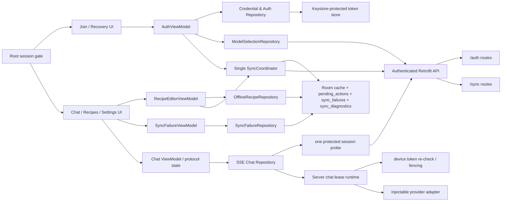

# Design — 阶段 2 原始目标端到端补全

## Context

既有阶段 2 完成了 `/auth`、`/sync` 的服务端语义和 PostgreSQL 证据，但原路线图的四项 AC还要求
Android 设备实际使用这些接口，以及聊天执行在设备令牌失效后停止。现有 Room 实体、`SyncPageApplier`
和冻结 wire 契约可复用；Android 没有凭证存储、网络层、同步协调器或可用页面，服务器也没有 chat runtime。

## Goal

以不改变 `contracts/v1` wire shape 的方式完成 AC5、AC6、AC10、AC12 的端到端行为：
一套 Android 凭证与同步链路、一套可操作的设备管理界面，以及能够被撤销令牌安全终止的聊天执行链路。

## Non-Goal

- 不把 AC1/AC2/AC3/AC4/AC7/AC8/AC9/AC11/AC13/AC14 标为完成；它们仍由各自阶段验收。
- 不修改冻结的 v1 HTTP、Sync、SSE 或 Function Calling wire contract。
- 不将 AI 消息加入离线 pending actions，也不在后台重发聊天。
- 不在本补全中引入多家庭、角色、库存、采购清单或新的服务器持久化迁移；允许本 Design 定义的 Room 内部元数据 migration，且不改变冻结 wire。
- 不以实现本补全所需的 chat receipt 生命周期为由，宣称 AC13 或 Function Calling 已完成；这些行为只维持冻结 v1 契约不被破坏。

## Scope Decisions

- AC5 不能通过一个只为测试而存在的假 chat endpoint 达成。M4 交付真实的、可配置的文本流聊天
  runtime：生产 adapter 调用已配置且声明 streaming 能力的模型，测试 adapter 只用于可控的失败与并发
  场景。Function Calling executor、确认草稿和菜谱/计划领域行为不属于此 runtime；provider 若在本范围内
  返回工具调用，runtime 以冻结的 `PROVIDER_ERROR` 流内错误终止，绝不伪造工具成功。
- 完成 R2-01 依赖 M4 的聊天 runtime；在 M4 合入前，AC5 只能维持“认证服务端部分已验证”。这不是将
  阶段 4 的所有功能提前实现，而是为 AC5 交付最小真实的聊天执行、租约和撤销防护垂直切片。
- R2-02/R2-04 的客户端实现采用“服务端基线 + 本地未确认动作覆盖层”。服务端变更先进入权威缓存，
  尚未得到 terminal ACK 的本地 patch 再按创建顺序重放；因此旧快照不会抹去仍待上传的用户修改。

## Architecture



`SessionBootstrapper` 是 App 唯一 root gate。启动时先读取安全 envelope：只有 active credential 与 matching、
`state=active` 的 `client_session` 才进入主导航；无 credential、switching、解密失败或 session 不匹配时，先完成清理并
显示 `JoinRecoveryScreen`，绝不挂载主导航或发出受保护请求。matching `state=provisioning` 的 credential 不进入主导航，
而由 `AuthViewModel` 恢复 provisioning，仅可重试完成默认模型加载和初始同步所需的受保护请求。`AuthViewModel` 的
bootstrap/register 成功后依序执行：三步切换创建 `state=provisioning` 的 matching session →
`ModelSelectionRepository.loadDefault()` → 初始 `SyncCoordinator.sync` → 在一个 Room transaction 提升 session 为 active →
进入主导航。`ALREADY_INITIALIZED` 且没有 active credential 时显示“联系部署者恢复”，不得自动重试 bootstrap；
部署者运行既有 recovery-reset 并将新家庭码交给用户后，用户才可进入 register。家庭码/secret 401 显示输入错误；模型或
初始同步网络失败停在可重试的 provisioning 状态而不伪造成功。已有 active session 重启可展示本地缓存，但 Chat 在成功刷新/
验证 session model 前禁用。

首台 `bootstrap` 响应中的 `familyCode` 由 `AuthViewModel.initialFamilyCode` 保存为不可 save 的一次性 UI state；
`JoinRecoveryScreen` 在 provisioning 中展示和确认它后立即清除。它不得进入 Room、Keystore envelope、日志、
备份或 `SavedStateHandle`；进程中断导致未展示时可由用户稍后在 Settings 轮换，不能把它当成持久恢复数据。

加入成功后 `AuthRepository` 把 token 写入安全存储并创建新的 `sessionGeneration`，
`SyncCoordinator` 以该 generation 取得 cursor、声明并上传 pending action、在单个 Room transaction
中应用回执。任一受保护请求的 401 调用 `SessionManager.invalidate(generation)`：仅当 generation 仍为
当前值时原子清除凭证、取消该 generation 的请求 scope，并通知 UI；任何请求在发出前及将响应写入
Room/UI 前都必须再次比对 generation。旧 generation 的迟到成功响应被丢弃。

`SseChatRepository` 用 OkHttp SSE 接收 `event/id/data`。M4 从既有生成 catalog 抽出增量
`SseStreamValidator`，逐 frame 校验 event 顺序、严格递增 eventId 与 data schema；收到 terminal 时它必须与
`validateSseTrace` 的完整 trace 结论一致。现有 `validateSseTrace` 故意要求 terminal，因此 transport close 的
有效非终态 prefix 不调用它、而由 `SseStreamValidator` 报告 `transport-closed`。`ChatViewModel` 只在同一
generation 下渲染 delta，且只在 `done` 后持久化完整 assistant 消息。收到正常 `error` 依冻结错误目录处理；
收到未带 terminal frame 的 transport close 时，不猜测 error code，
取消流并最多执行一次 `GET /api/v1/auth/devices` 无领域副作用的 session probe（现有 auth middleware 会刷新
`lastUsedAt`）：401 调用
`SessionManager.invalidate(generation)`，其他结果保留 credential 并显示可重试的“聊天已中断”。因此撤销不会把
`UNAUTHORIZED` 写进 SSE，而用户仍会从一个合法 JSON 401 获得明确的会话失效状态。

`ModelSelectionRepository` 只管理非敏感的 `selectedModelId`：凭证激活后调用 `GET /api/v1/models`，严格验证
`ModelListResponse` 有且仅有一个 default，再把该 id 写入 matching `client_session`；ChatViewModel 只能从它读取
modelId。models 请求 401 走 session invalidation；列表为空、多 default 或网络失败禁用聊天并留在 provisioning retry，
不回退到猜测的 model id。模型切换 UI 仍属 AC4，不由本补全实现。

## Interface Contract

| 行为 | 接口/模块 | 输入 | 输出 | 错误与幂等性 |
|---|---|---|---|---|
| AC5 加入 | `SessionBootstrapper` / `AuthViewModel.bootstrap/register` → auth API | 安全 envelope 或用户输入与 deviceName | `JoinRecovery/Provisioning/Authenticated` 状态 | 仅 bootstrap/register 成功激活 credential；401/409/网络错误保持在可操作入口 |
| AC5 默认模型 | `ModelSelectionRepository.loadDefault` → `GET /models` | matching session credential | `client_session.selectedModelId` | 401 清会话；无唯一 default 或网络失败禁用聊天，不猜测 modelId |
| AC5 聊天终止 | `SseChatRepository.send` → `POST /api/v1/chat` | 冻结 `ChatRequest` + Bearer token + session generation | Chat state：`start/delta/error/done` 或 transport-closed | 建流前为 JSON 401；撤销后的已建流连接只关闭，不产生非法 SSE `UNAUTHORIZED`；客户端仅用一次 `GET /auth/devices` probe 取得 JSON 401 |
| AC6 菜品离线 mutation | `RecipeEditorViewModel` → `OfflineRecipeRepository.patch/delete` | 用户编辑的 recipeId 与 patch/delete command | effective local recipe projection + canonical pending action | 同一 transaction 写 action；不存在/已 tombstone 的本地资源拒绝；不直接修改权威 cache version |
| AC6/12 同步 | `SyncCoordinator.sync(reason)` | 当前 token、Room cursor、最多 100 action | 原子更新 Room 与失败记录 | M2 先交付首次 snapshot；M3 扩展 action drain/ACK。401 清凭证；网络/协议错误恢复 claim；rejected 不自动重传 |
| AC12 失败展示 | `SyncFailureRepository` → `SyncFailureViewModel` | action 的 `sync_failures`，或 cursor/protocol 的 `sync_diagnostics` | 可观察的 action failure/diagnostic 列表、对应处理 intent | action failure 不自动重传，只能 discard/re-edit；diagnostic 可 dismiss 或在下次完整 sync 成功后清除；绝不伪造 actionId |
| AC10 设备管理 | `SettingsRepository.list/rotate/revoke/logout` → 既有 auth API | 当前 token、目标 deviceId（如有） | 冻结 DeviceList/Rotate/Revoke/Logout DTO | UI 仅撤销 `isCurrent=false` 的设备；当前设备以 logout 等价替代 revoke；401 清凭证；仅成功响应改变本地状态 |

服务端 chat runtime 使用现有 `chat_request_receipts`、`conversations` 和 `device_tokens` 数据模型，
不新增表。`MEALMATE_MODELS_FILE` 是 Compose 主机侧源文件，M2 的 production Compose 必须将其只读挂载为
`/run/config/models.json`，并把**容器内路径** `/run/config/models.json` 传给 app；运行时 `ModelCatalog` 只能读取该
容器内路径，绝不尝试读取主机原路径。M2 先新增 `ModelCatalog`、config/readiness 校验、`GET /models` 与
`node dist/cli.js models verify`，M4 复用它：严格读取模型目录的
`id/displayName/baseURL/model/apiKeyEnv/enabled/isDefault/capabilities`，仅把
`enabled && capabilities.streaming && capabilities.tools && apiKeyEnv 已解析` 的项纳入 allowlist。目录结构错误
（重复 id、非法 URL、非法 capabilities）使 readiness 失败；单个候选项缺少 apiKeyEnv 时只从 allowlist 排除；
allowlist 为空或其中的 default 不是恰有一个时才使 readiness 失败。`GET /api/v1/models` 只返回 allowlist 的公开字段；
新设备以唯一 default 作为初始选择。`POST /chat` 必须用请求中的 `modelId` 经
`ModelCatalog.resolveRequested` 精确解析，否则在建流前返回冻结 `MODEL_UNAVAILABLE`，不得静默替换为 default。
生产 adapter 从该模型的环境变量引用取得密钥，日志只记录 model id、requestId、耗时和错误码；测试 adapter
为脚本化实现。`models verify` 对每个 enabled 模型执行不含敏感数据的流式 no-op tool 探测，30 秒内要求非空 delta
与合法 tool call，只输出 model id、pass/fail 与错误类别；任一失败阻止人工发布。启动/readiness 仍只做静态目录、
URL scheme 和 key 存在性校验，不访问 provider。runtime 的文本流不执行 Function Calling；若 provider 在本范围内返回工具调用，流内以允许的
`PROVIDER_ERROR` 终止，且不产生工具或同步写入。

### Chat lease 与撤销 fencing

1. 创建或重试请求时，runtime 先锁定当前 device token 行，再锁定 `(deviceId, chatRequestId)` receipt。
   request hash 不同返回冻结的幂等冲突；completed 重放持久化最终结果；同 ID running 返回
   `CHAT_IN_PROGRESS`；同设备其它未过期 running receipt 返回 `CHAT_DEVICE_BUSY`。
2. 过期 receipt 仅由用户以同一 requestId 重试接管：在锁内递增 `leaseGeneration`、更新 30 秒
   lease 和心跳；每 10 秒续租时再次锁定 token 行和 receipt，并比较 generation。
3. 每个聊天持久化写入在一个事务内先 `SELECT device_tokens ... FOR UPDATE`，确认 `revoked_at IS NULL`，
   再锁 receipt 并比较 `(status=running, leaseGeneration)`，最后写入。revoke/logout 更新同一 token 行，
   因而两者严格串行：聊天先提交则写入发生在撤销前；撤销先提交则聊天检查失败且不能提交新写入。
4. token 已撤销、lease 失效或 generation 不匹配时，取消 provider，把 receipt 置为
   `failed(errorCode=UNAUTHORIZED,retryable=false)` 并关闭本 generation。已经写出 `start` 的流**不**追加
   `UNAUTHORIZED` error（该码只允许 JSON）；App 用一次无领域副作用的 session probe 获得 401。60 秒 idle 使用
   `MODEL_TIMEOUT`，provider/工具调用失败使用 `PROVIDER_ERROR`；两者以带严格递增 eventId 的 SSE `error`
   终止。流已建立后不能追加 HTTP `Retry-After`，客户端从生成的错误目录为 `PROVIDER_ERROR` 派生 5 秒
   retry cooldown，不能与撤销混同。

receipt 创建、接管、心跳、完成和失败都遵守现有 DB CHECK 的状态组合；聊天断开本身不提交 completed，
用户重试同一 requestId 才按 lease/receipt 状态恢复或重放。

完成文本聊天时，在同一事务写入 final receipt 并把 user/assistant 两条带 `chatRequestId` 的消息追加到
`conversations`。保留最新 20 个完整轮次（40 条消息）；到达该窗口外的 completed 或 failed receipt 同一事务转为 `expired`，
清除 modelId、message、tool receipts、final response 和 error detail，只保留 request hash。completed 同 ID
重试发出 `start(replayed=true,resumed=false)`、完整 delta 和 `done`；retryable failure 的同 ID 重试才可接管。
当新 ID 到来时，必须在已锁定的 token 行内把同设备已过期 running 或 retryable failed receipt 置为
`failed(errorCode=CHAT_REQUEST_SUPERSEDED,retryable=false)` 后再创建新 receipt；旧 ID 的同内容重试在建流前
返回 JSON 409 `CHAT_REQUEST_SUPERSEDED`。expired receipt 的同内容重试在建流前返回 JSON 410
`CHAT_REQUEST_EXPIRED`；同 ID 不同内容仍为 JSON 409 `IDEMPOTENCY_KEY_REUSED`。上述生命周期用于保持 frozen
contract/DB CHECK；不构成 AC13 完成声明。

Android 新增的领域接口保持在 data 层：

```kotlin
interface DeviceCredentialStore {
    suspend fun read(): DeviceCredential?
    suspend fun save(credential: DeviceCredential)
    suspend fun clear()
}

interface SyncCoordinator {
    suspend fun sync(reason: SyncReason): SyncRunResult
}

interface OfflineRecipeRepository {
    suspend fun patch(recipeId: String, patch: RecipePatchCommand): LocalMutationResult
    suspend fun delete(recipeId: String): LocalMutationResult
    suspend fun replaceFailed(
        failedActionId: String,
        recipeId: String,
        patch: RecipePatchCommand,
    ): LocalMutationResult
}

interface ModelSelectionRepository {
    suspend fun loadDefault(sessionGeneration: Long): ModelSelectionResult
    suspend fun selectedModelId(sessionGeneration: Long): String?
}

interface SettingsRepository {
    suspend fun list(): DeviceListResponse
    suspend fun rotateFamilyCode(): RotateFamilyCodeResponse
    suspend fun revoke(deviceId: String): RevokeDeviceResponse
    suspend fun logout(): LogoutResponse
}

interface SyncFailureRepository {
    fun observe(): Flow<List<SyncIssueView>>
    suspend fun discardActionFailure(failedActionId: String): FailureResolution
    suspend fun dismissDiagnostic(diagnosticId: String): FailureResolution
}
```

`RecipePatchCommand(name: String?, tags: List<String>?)` 只能表达冻结 `recipe.patch` 的 `name` 与 `tags`：
至少一个字段非 null；有值的 name 长度为 1..100，tags 最多 20 项、每项最多 30 个字符。repository 必须将其映射为
生成的 `SyncActionDto` 并由生成 validator 再验证，不能手写另一份 wire DTO。`LocalMutationResult.Applied` 返回新的
effective projection 与 actionId；`Rejected(reason=Missing|Tombstoned|InvalidPatch|SessionChanged)` 不写 action、不触发同步。
`RecipeEditorViewModel` 是 Recipes 页的最小编辑/删除输入适配器：离线时调用该 repository 并显示 effective projection，
在线时同样由它创建 action 后请求立即同步，禁止页面或测试直接写 pending 表。

`SyncFailureRepository` 以 DAO 分别查询 `sync_failures` 与新的 `sync_diagnostics`，`SyncFailureViewModel` 将错误码、
用户可读 message、关联资源和可用操作暴露给 Recipes/sync-status UI。页面必须显示 rejected action failure 及
cursor/protocol diagnostic，且不提供自动重试；用户 discard action failure 时同一 transaction 删除 failed action 与
对应 failure，用户从 action failure 卡片进入 RecipeEditor 重新编辑时调用 `replaceFailed`，在同一 transaction 删除指定
旧 failure/failed action、生成新的 UUID actionId 与 pending action。diagnostic 不关联 action，用户只能 dismiss，或在下一次
完整 sync 成功后由 Coordinator 清除。所有记录在对应显式处理或自动清除前保持可见。

`SyncIssueView` 是两个不可混用的 UI 投影：`ActionFailure(actionId, errorCode, message, resource?)` 与
`Diagnostic(diagnosticId, kind=Cursor|Protocol, errorCode, message, resource?)`。`FailureResolution.Discarded` 仅在同一事务
删除 failed action/failure 后返回，`FailureResolution.Dismissed` 仅在删除指定 diagnostic 后返回；
`FailureResolution.NotFound` 和 `FailureResolution.SessionChanged` 保持原记录且不伪造成功。重新编辑不复用 discard，
而由 `OfflineRecipeRepository.replaceFailed` 显式完成“移除指定旧 failure + 创建新 action”的事务。

`DeviceCredentialStore` 用 AndroidKeyStore 中别名 `mealmate_device_token_v1` 的 AES-GCM key 加密
`{deviceId,token,sessionId,sessionGeneration}`，其中 `sessionId` 为每次 bootstrap/register 新生成的随机 UUID，并且是
与 Room `client_session` 的唯一匹配键；密文只放在 app-private `noBackupFilesDir`，不使用 Room、普通
SharedPreferences 或可备份位置。不可解密、密钥失效和 401 都走同一 session invalidation 流程。

`OfflineRecipeRepository.patch/delete` 与 `SyncCoordinator` 共用 `StateMutationMutex`。它在一个 Room transaction
内：重查 session generation 与权威 recipe（不存在或 tombstone 则拒绝）→ 生成 UUID actionId → 由生成 DTO 校验
并按 RFC 8785 生成 canonical `payloadJson/payloadHash` → 插入 `pending_actions(state=pending)`。权威 `recipes` cache
不因本地操作改写 serverVersion；UI 的 effective recipe projection 将权威 cache 与按 `(createdAt,actionId)` 顺序的
pending/sending action overlay 合并，patch 覆盖字段、delete 隐藏资源。事务成功后才请求立即同步；网络不可用只保留
pending action。双客户端验收必须从该 repository 调用开始，禁止测试直接插入 pending 表。

`SyncCoordinator` 与本地菜品 mutation 共用 process-wide `StateMutationMutex`，因此快照、ACK 和本地
乐观 patch 有单一写入顺序。启动、回到前台、立即同步和 Worker 都只调用它：周期任务名
`mealmate-sync-periodic` 使用 `ExistingPeriodicWorkPolicy.KEEP`，立即任务名 `mealmate-sync-now` 使用
`ExistingWorkPolicy.KEEP`，两者要求 network connected 并在 Coordinator 内再次取得 mutex。

一次 `sync(reason)` 的固定状态机为：取得 mutex 和 matching session generation → 恢复超过五分钟的 sending
claim → 拉取并原子应用页面直至 terminal → 按 `(createdAt, actionId)` claim 至多 100 个 action → 上传该 batch
并逐项 CAS 应用 ACK → 重复 claim/upload，直到没有 pending action → 再拉取并应用页面直至 terminal。每一个
网络响应和 Room 写入前后均重查 generation；任意网络错误停止本次 run，保留原 actionId。HTTP 409
`IDEMPOTENCY_KEY_REUSED` 从 JSON `details[]` 中唯一的 `{field:"actionId",reason:<actionId>}` 读取冲突动作：该 action 在同一 transaction 标为 failed 并写
`sync_failures`，同 batch 其他仍 sending action 回到 pending，用原 ID 重投以获取 duplicate 原结果。任意
`requiresFullResync=true` ACK 使该 action failed、保留 failure、清 cursor 与缓存、释放本 batch 其它 claim；
随后从全量 snapshot 重启拉取阶段，成功后再继续 drain。未知、缺失、重复或乱序 ACK 是协议失败：不应用本
attempt 的任何 ACK，并在一个 transaction 把该 attempt 所有仍 sending 的 action 恢复 pending、保留 actionId、
写入新的 `sync_diagnostics(kind=protocol)`。cursor、页解码或响应不变量失败同样不改 cache/cursor，并写入
`sync_diagnostics(kind=cursor|protocol)`；这些 diagnostic 不得占用或伪造 actionId。完整 sync 成功后才清除当前 session 的
diagnostic。每轮所有 pending 都没有 terminal 结果才可返回成功。

Room DAO 扩展为：恢复 stale claim；按 `(createdAt,actionId)` claim 最多 100 项并生成 attemptId；所有
ACK 应用必须以 `(actionId,attemptId,state=sending)` compare-and-set；旧 attempt 的迟到响应不改变当前
记录。每一页在解码并验证后才以单 transaction 应用权威变更、重放仍 pending/sending 的乐观 patch、
更新 cursor。内部 `replica_versions(resource,resourceId,serverVersion)` 记录每个已应用权威资源版本：
仅当 incoming version 大于已记录版本时写缓存和元数据，等于时为幂等 no-op，小于时跳过；随后才重放
未确认本地 patch/delete 覆盖层。所有 JSON 从生成 DTO 解码，禁止手写 wire model。

`replica_versions` 的 key 必须由生成的 `SyncChange` union 唯一推导，不能由页面位置或本地猜测生成：
`recipe` 的 upsert 与 tombstone 均为 `(recipe, data.id)`，`weekly_plan` 为 `(weekly_plan, data.id)`，
`settings` 为 `(settings, data.key)`（当前为 `familyPreference`）。sync envelope 的 resource 必须与该 union
分支一致；不一致即把整页视为无效。快照页的 `(resource,resourceId)` 排序与重复校验使用完全相同的 tuple。

## Data Model

不新增服务器表或迁移。Room 增加只含本地协调元数据的 `client_session`、`replica_versions` 和
`sync_diagnostics`，并提供 Room migration；它们不改变已冻结实体或 wire 映射。复用数据如下：

| 本地数据 | 生命周期与约束 |
|---|---|
| device credential | Keystore AES-GCM 加密的 no-backup 文件；401、注销成功或撤销确认后删除；重加入前清除所有前一 session 本地状态 |
| `pending_actions` | `pending → sending → pending/failed/removed`；claim/ACK 以 `(actionId,attemptId)` fencing；同一 actionId 永不重写为新 ID |
| `sync_failures` | rejected 或其 duplicate original 为 rejected 时保留失败码、文案、权威资源和版本；用户丢弃或重新编辑前不自动上传 |
| `sync_diagnostics` | 本地 `diagnosticId TEXT PRIMARY KEY`、`kind TEXT CHECK(cursor/protocol)`、`errorCode`、`message`、`resource TEXT NULL`、`createdAt`；没有 actionId，用户 dismiss 或本 session 下一次完整 sync 成功后删除 |
| `sync_state` | 仅响应不变量和整页 Room 写入都成功后推进 cursor；terminal page 依冻结契约清为 null，下一轮从新 snapshot 开始；full-resync 同样清为 null |
| `chat_draft` | 仅未送达消息；不由 Worker 发送 |
| `client_session` | singleton `id=0`、`sessionId TEXT NOT NULL`、`state TEXT CHECK(switching/provisioning/active)`、`selectedModelId TEXT NULL`；启动时只接受与安全凭证同一 active session 的 Room 数据，matching provisioning 只能回到 provisioning 恢复 |
| `replica_versions` | `resource TEXT NOT NULL`、`resourceId TEXT NOT NULL`、`serverVersion TEXT NOT NULL`（严格 bigint 十进制）；`PRIMARY KEY(resource,resourceId)`，拒绝旧 snapshot/incremental/ACK 回退 |

Session invalidation 或新的 bootstrap/register 成功使用可恢复的三步切换，而非声称跨文件与 Room 原子：
先将 Keystore 密文 envelope 写为不可使用的 `switching(nextSessionId)`；再在一个 Room transaction 清除
旧 `pending_actions`、`sync_failures`、`sync_diagnostics`、`sync_state`、缓存、`chat_draft` 与 `replica_versions`，写入 matching
`client_session(provisioning,nextSessionId)`；最后才将 envelope 提升为包含相同 `sessionId` 的可读 active credential。
只有默认模型与初始同步都成功，才在 Room transaction 将它升为 `active`。启动若发现 switching、不匹配或不可解密状态，
必须先重复清理 transaction，绝不返回 token 给网络层；发现 matching provisioning 则恢复 provisioning，绝不挂载主导航。
失效时同样先写 switching，再清 Room，最后删除 envelope。旧家庭的数据和 actionId 不得携带到新凭证。

撤销的严格 serializability 只适用于聊天 runtime：它的每个持久化写入都重新锁定 token 行。独立的
`/sync/actions` 请求在路由鉴权成功后可完成已开始的单项事务；撤销提交后的新受保护请求必为 401。原始 AC5
所称“不再写入”在本补全中指被撤销的**活动聊天**不得再写 conversation、tool 或 chat 触发的 sync change，
而不是为既有 sync API 引入未冻结的中途撤销语义。

## Non-Functional Requirements

| 维度 | 指标 |
|---|---|
| 安全 | token 不进入 Room、日志或普通偏好；401 后在本次请求链停止后续 I/O |
| 并发 | 同进程任意时刻至多一个 SyncCoordinator run；聊天租约 30 秒、心跳最多 10 秒 |
| 一致性 | 每个已验证同步页、ACK 和 rejected duplicate original 均以单个 Room transaction 应用；cursor 仅在成功页后前进 |
| 可靠性 | sending claim 5 分钟后可恢复；周期同步 30 分钟；网络错误不伪造 ACK 结果 |
| 性能 | 非 AI 受保护 GET/PATCH p95 ≤300ms、p99 ≤800ms；同步页 p95 ≤500ms；聊天超时遵守 60 秒 idle/5 分钟总时长 |
| 可测试性 | 后端 PostgreSQL 16、Android MockWebServer + in-memory Room；Room 升级使用磁盘型 v1→v2 migration test；脚本化 provider，不调用公网 |
| 日志 | release 构建禁用 OkHttp body logging；debug interceptor 也必须脱敏 Authorization、Cookie、token、家庭码及请求/响应正文 |

## Error Handling

| 失败 | 处理 |
|---|---|
| 认证 API 或 sync 返回 401 | `SessionManager` 仅失效匹配的 generation，取消其 scope、清凭证和该 session Room 数据，UI 导向加入/恢复；旧响应不可再写入 |
| 同步网络中断 | 仅将本 attempt 仍为 sending 的 action 恢复 pending；保留原 actionId，迟到 ACK 因 attempt fencing 被丢弃 |
| applied/duplicate ACK | duplicate 先展开其 original；applied original 在 transaction 应用权威资源并删除 action，rejected original 走 rejected 分支 |
| rejected ACK | 有权威资源时同事务应用资源、写 `sync_failures`、action 变 failed；requiresFullResync 时清 cursor 和缓存、保留 failure，下一轮先全量快照且不展示旧乐观资源 |
| cursor/响应解码失败 | 不推进 cursor、不改 cache/claim；写 `sync_diagnostics` 并以运行时 `SyncRunResult.Failed` 通知 UI，不把该页视为成功 |
| 聊天令牌撤销/租约失效 | 禁止当前 generation 的持久化写入；撤销后的已开始流仅关闭，由一次无领域副作用 probe 的 JSON 401 失效会话；timeout/provider failure 才发送冻结 SSE `error` |
| 设置 mutation 失败 | 不乐观更新设备列表或家庭码；显示可重试错误 |

同步响应的“完整有效”要求：`hasMore=true` 必须有此前未见的 nonblank `nextCursor`；`hasMore=false`
依冻结 C8 不得有 nextCursor，Coordinator 在该 terminal page 成功后保存 null，并在下一次 run 从新 snapshot
开始（这会多读但不会漏失新写入）。增量页 `serverVersion` 严格递增，快照页 `(resource,resourceId)`
严格递增且无重复；每个 ACK 与本 attempt 的 actionId 一一对应且顺序一致，未知、缺失或重复 actionId
使整次 attempt 失败，不应用部分 ACK。

## Alternatives Considered

| 方案 | 优点 | 缺点 | 结论 |
|---|---|---|---|
| 仅把路线图文字改为“服务端完成” | 最小改动 | 原始用户 AC 仍无实现，掩盖缺口 | 不采用 |
| 每个页面各自上传 pending actions | 初始代码少 | 并发上传、cursor 和 failed 回滚会分叉 | 不采用 |
| 单一 Coordinator + Worker/前台入口复用 | 可证明单飞和相同回执语义 | 需要明确 DAO 事务边界 | 采用 |
| 用假聊天 endpoint 只验证撤销 | 快速满足单测 | 生产没有真实 provider/租约语义，制造新假完成 | 不采用 |
| 把撤销检查放在写事务外 | 代码少 | revoke 可在检查后、提交前发生 | 不采用；token 行锁与 receipt generation fencing 必须同事务 |

## Testing Strategy

| 接口/模块 | 层级 | 验证 | 通过标准 |
|---|---|---|---|
| chat token re-check/fencing | PostgreSQL integration | provider barrier 与 revoke/logout 竞争、lease takeover、superseded 旧 ID 的 JSON 409、旧 generation 写入、20 轮裁剪与 expired 同内容 JSON 410 重放 | token 行锁决定顺序；撤销后无 final/conversation/tool/chat-triggered sync 写入；已 start 的连接安全关闭、不发非法 SSE error；新 JSON probe 为 401 |
| Android auth/root gate | JVM + instrumented + MockWebServer | 无 credential、switching、不匹配 sessionId、bootstrap/register、bootstrap 成功但 credential 落盘前崩溃后的 `ALREADY_INITIALIZED` recovery、401、默认模型与初始同步的 provisioning 顺序、initial sync 失败后杀进程重启、首台 familyCode 一次性展示 | 未 authenticated 前不挂载主导航或发保护请求；matching provisioning 只恢复 provisioning；`ALREADY_INITIALIZED` 无 token 只进入部署者 recovery、不循环 bootstrap；成功只在 credential/model/sync 全部就绪后进主导航；familyCode 不落盘/日志/备份，失败有可重试入口 |
| Android chat/auth | JVM + instrumented + MockWebServer | incremental validator 与完整 trace 等价、合法 nonterminal prefix 的 transport close、start/delta/done 和 eventId 校验、transport close 后一次 probe、401、半条消息/旧 generation 丢弃、密文文件/备份边界/密钥失效、切换中崩溃恢复 | token 不在 Room/偏好/日志；撤销后不再渲染 delta 或写 Room；probe 仅允许刷新 lastUsedAt，网络失败不伪造未授权 |
| ModelCatalog/provider | JVM + PostgreSQL integration + Compose/config test | strict models 文件、容器内 `/run/config/models.json` 路径、unique default、次要模型缺 apiKeyEnv 排除、allowlist 为空/readiness、`models verify` 的脚本化 no-op tool 成功/30 秒失败、streaming+tools allowlist、URL 和日志脱敏、脚本化 provider 错误与 client 5 秒 cooldown | 目录结构错误或无可用唯一 default 才不能 ready；容器不读取宿主路径；verify 失败阻止发布且不泄露 URL/key/body；`MODEL_UNAVAILABLE` 仅在建流前 JSON 返回；provider error 使用合法 SSE error，流后 cooldown 来自生成目录而非 HTTP header |
| OfflineRecipeRepository/RecipeEditor | JVM + in-memory Room + Compose + MockWebServer | patch 的 name/tags 边界与生成 DTO 一致、repository patch/delete 生成 canonical action、`replaceFailed` 原子替换、effective projection、同一 transaction rollback、两独立客户端从 RecipeEditor 离线编辑后恢复网络 | 不直接写权威 serverVersion；成功调用后才有一个 pending action；replaceFailed 仅移除指定 failed action/failure 并产生新 actionId；tombstone/不存在/无效 patch 不会生成 action；页面从不直写 pending 表 |
| SyncCoordinator | JVM + in-memory Room + MockWebServer | M2 首次多页 snapshot/provisioning 解锁；M3 terminal page 后新写入、101 action drain、409 中项冲突、无效 ACK 的 claim 回滚、旧快照与乐观 patch、network failure、stale/late attempt、applied/duplicate/rejected/full-resync | cursor 原子推进；null cursor 重启 snapshot 不漏失；原 actionId 重投；409 只失败冲突项；无效 ACK 不应用部分结果且立即恢复 claim；replica_versions 无版本回退 |
| SyncFailure presentation | JVM Room + Compose | action failure 与 cursor/protocol diagnostic 均显示 errorCode/message/resource；前者 discard、从 failure card 进入 `replaceFailed`，后者 dismiss/完整 sync 自动清除 | action failure 在显式 resolve 前可见且不自动重传；discard/re-edit 原子移除指定旧 failure，re-edit 产生新 actionId；diagnostic 没有 actionId 且不触发 re-edit |
| single-flight Worker | JVM/Android worker test | 前台、周期 worker、立即 worker 和进程重建同时触发 | 固定 unique names/network constraint；每个 process 仅一次上传，跨重启靠 claim fencing 正确恢复 |
| Settings UI | Compose + MockWebServer | 轮换、列设备、仅撤销其它设备、注销、旋转结果重组/返回/进程重建 | 新码只保留于非 saveable ephemeral state；当前设备不显示 revoke 而走 logout；失败不误报成功 |
| Room migration/logging | instrumented disk DB + unit/config test | 从 v1 schema 升级、旧缓存/DAO/session 清理、release/debug HTTP logging | migration 后数据可读且新表可用；任何日志配置均不输出 token、认证头或正文 |
| two-client acceptance | PostgreSQL 16 server harness + 两个独立 Room/credential client fixture | 可控网络恢复、server lock/revoke barrier、各自最终缓存 | 两客户端连接同一真实 server；AC5/6/10/12 断言均通过后才允许 R2-05 解除阻塞 |

执行 Plan 必须显式加入 `com.squareup.okhttp3:mockwebserver`、`androidx.room:room-testing` 与
`androidx.work:work-testing` 的测试依赖（复用现有 OkHttp/Room/Work 版本）；JVM 负责协议、Coordinator 与
repository，instrumented test 负责 Keystore、磁盘 migration、Compose 与 Worker。

## Milestones

| 里程碑 | 产出 | 依赖 |
|---|---|---|
| M1 | remediation 的执行 Plan 与测试基线 | 本 Spec/Design 获确认 |
| M2 | Root session gate、Keystore token、加入/恢复 UI 的 provisioning 状态、服务端 ModelCatalog/`GET /models`/readiness/`models verify`/Compose 容器路径、Android ModelSelection、**首次 snapshot SyncCoordinator（成功后解锁主导航）**、Settings UI | M1 |
| M3 | RecipeEditorViewModel/最小编辑删除 UI、OfflineRecipeRepository、SyncCoordinator 的 action drain/ACK 扩展、SyncFailureRepository/ViewModel/UI、Room DAO 事务、WorkManager | M2 |
| M4 | 文本流 chat runtime、SSE Chat Repository/ViewModel、完整 receipt/lease 与撤销 fencing | M3；既有 `MEALMATE_MODELS_FILE` 配置契约 |
| M5 | 两设备端到端验收与文档状态同步 | M2、M3、M4 |
