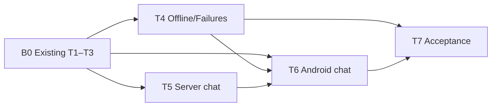

# 阶段 2 原始目标端到端补全 — Implementation Plan

**Branch:** main
**Baseline SHA:** b02c4d0
**Worktree Path:** /home/yangyang/workspace/codes/Yggdrasil-Labs/mealmate-project/mealmate-lite
**Started At:** 2026-08-26T23:10:25+08:00
**Updated At:** 2026-08-28T22:40:55+08:00

**Goal:** 以真实 Android 用户路径完成 AC5、AC6、AC10、AC12，且不改冻结 v1 wire。
**Architecture:** 服务端先提供模型目录与 chat runtime；Android 以 Keystore root gate、Room 和单一 Coordinator 实现加入、同步、设置和离线编辑。action failure 与 cursor/protocol diagnostic 分离持久化与 UI 操作。
**Tech Stack:** Node 24、TypeScript、Hono、PostgreSQL 16、Kotlin、Compose、Room、WorkManager、Retrofit、OkHttp。
**Commit Mode:** per-task
**Effective Execution Mode:** serial
**Execution Mode Reason:** 用户明确授权直接在本地 main 执行，未创建隔离 worktree；所有后续任务串行执行。
**Ledger Mode:** controller-commits

**Plan Verdict:**
- **Status:** in-progress
- **Verified At:** 2026-08-28T22:40:55+08:00
- **Evidence:** 后端 typecheck、189 个单元测试、80 个 PostgreSQL 16 集成测试通过，Biome 为 0 error/29 info；Android ktlintCheck、detekt、lintDebug、checkContractModels、testDebugUnitTest 与 androidTest Kotlin 编译通过。
- **Blocked Tasks:** T4（AC2 的 Managed Device 执行）
- **Concerns:** T1–T3 的历史提交未完整满足本计划后来引入的 Task-ID/执行账本协议，按用户授权作为 B0 既有实现基线接纳，不回填或伪造历史 Red/Verify 证据。当前 WSL2 宿主无 `/dev/kvm`，无已连接 adb 设备，因此无法运行 x86_64 Managed Device。

**Accepted Risks:**

| Risk ID | Risk | Accepted By | Accepted At | Source |
|---|---|---|---|---|
| none | none | none | none | none |

## B0：既有实现基线（T1–T3）

2026-08-26，用户明确授权以 `b02c4d0` 为后续整改基线，并将既有 T1–T3 实现接纳为依赖前提：

- T1 模型目录与发布验证：`cb98a1b`
- T2 安全会话、加入恢复与设置：`9b064da`
- T3 Room migration 与首次快照：`780fbb0`

这些提交保留为可追溯的历史实现，但不追溯性声明其满足本计划的 Red/Verify/Task-ID 协议。它们不再作为剩余任务的执行门禁；T4、T5、T6 直接依赖 B0 的现有接口与行为。

## Global Constraints

- 不修改 `contracts/v1` 的 HTTP、Sync、SSE、Function Calling wire 或错误目录。
- token 仅保存于 AndroidKeyStore AES-GCM 加密的 `noBackupFilesDir` envelope，不进入 Room、偏好、备份或日志。
- root gate 只有 matching active credential/client_session 才进主导航；`switching/provisioning` 不得进入。
- app 只读取容器内 `/run/config/models.json`；`models verify` 对每个 enabled 模型 30 秒内验证 no-op streaming tool，且不泄露敏感值。
- 单进程只有一个 Coordinator；30 分钟周期、5 分钟 stale claim、单批最多 100 action、actionId 不重写。
- rejected action 只用 `sync_failures(actionId)`；cursor/protocol 只用无 actionId 的 `sync_diagnostics(diagnosticId)`。
- 聊天租约 30 秒、心跳最多 10 秒、idle 60 秒、总时长 5 分钟；已开始 SSE 撤销仅安全关闭。
- 测试使用 MockWebServer、Room disk migration、PostgreSQL 16 与 scripted provider，不访问公网。
- Task commit 只包含本 Task 文件并附 `Task-ID`；controller 单独更新本 Plan ledger，未经授权不提交。

## Dependency Graph

| Task | 依赖 | 可并行组 |
|---|---|---|
| B0 | 既有实现基线 | — |
| T4 | B0 | D |
| T5 | B0 | B |
| T6 | B0、T4、T5 | E |
| T7 | T4、T6 | F |

---

### T1: 模型目录、容器路径与 verify

**Depends on:** 无

**Files:**
- Modify: `server/src/config.ts`, `server/src/app.ts`, `server/src/routes/index.ts`, `server/src/cli.ts`, `docker-compose.yml`
- Create: `server/src/services/models/model-catalog.ts`, `server/src/routes/models.ts`, `server/src/services/models/model-catalog.test.ts`, `server/src/config.test.ts`, `server/src/routes/models.integration.test.ts`, `server/src/cli.models-verify.test.ts`

**Interfaces:**
- Consumes: frozen `ModelListResponse`.
- Produces: `ModelCatalog.listPublic(): ModelListResponse`, `ModelCatalog.resolveRequested(modelId: string): ConfiguredModel`, `runModelVerify(): Promise<void>`.

**Behavior:** 严格加载容器内目录、公开 allowlist、静态 readiness 与可注入的发布 verify；不访问真实 provider。

**Acceptance Criteria:**
- [ ] Compose/app 均使用 `/run/config/models.json`，模型 route 只返回公开 allowlist。
- [ ] default/key/URL/verify 超时错误可机械验证且不泄露 URL、key 或正文。

**Execution:**
- **Status:** skipped
- **Commit SHAs:** ["cb98a1b"]
- **Dispatch Base SHA:** null
- **Dispatch Ref:** null
- **Attempts:** 0
- **Blocked Reason:** B0 历史基线接纳；旧提交缺少本计划所需的完整执行账本，按用户授权不追溯重做。
- **Red Result:** null
- **Verify Result:** null
- **AC Result:** null
- **Concerns:** 历史实现仅作依赖基线，不作为本计划 Task Completion Gate 的合规证据。

**Task Completion Gate:**
- [ ] Expected failing Red evidence exists
- [ ] Verify Result exists and passed
- [ ] AC Result: null (task AC declares no per-task AC) OR (total > 0 AND pass + deferred.length == total, non-deferred AC all verified)
- [ ] Every Commit SHA in the ordered task chain belongs to this task only
- [ ] Per-task AC checkbox synced

**Step 1: Red**
First add the listed unit/integration test assertions for catalog loading, public response and redaction, then run:
Run: `mise exec -- pnpm --dir server run test:unit -- model-catalog.test.ts cli.models-verify.test.ts && mise exec -- pnpm --dir server run test:integration -- models.integration.test.ts`
Expected: **FAIL** — catalog/route/verify are absent.

**Step 2: Green**
Implement typed config, compose container path, catalog/route, scripted verify and redacted output.

**Step 3: Verify**
Run: `mise exec -- pnpm --dir server run test:unit -- model-catalog.test.ts config.test.ts cli.models-verify.test.ts && mise exec -- pnpm --dir server run test:integration -- models.integration.test.ts`
Expected: **PASS**

**AC Verification:**
- [ ] AC1: route/config tests assert container path and public response only → PASS.
- [ ] AC2: timeout/missing-key tests assert readiness and redaction → PASS.

**Step 4: Commit**
`feat(models): 实现模型目录与发布验证` with `Task-ID: T1`.

---

### T2: 安全会话、加入恢复、默认模型与设置

**Depends on:** T1

**Files:**
- Modify: `app/app/build.gradle.kts`, `app/gradle/libs.versions.toml`, `app/app/src/main/java/io/yggdrasil/labs/mealmate/lite/ui/navigation/MealMateNavHost.kt`
- Modify: `app/app/src/main/java/io/yggdrasil/labs/mealmate/lite/ui/settings/SettingsScreen.kt`
- Create: `app/app/src/main/java/io/yggdrasil/labs/mealmate/lite/data/auth/DeviceCredentialStore.kt`, `app/app/src/main/java/io/yggdrasil/labs/mealmate/lite/data/auth/SessionManager.kt`, `app/app/src/main/java/io/yggdrasil/labs/mealmate/lite/data/remote/MealMateApi.kt`, `app/app/src/main/java/io/yggdrasil/labs/mealmate/lite/data/models/ModelSelectionRepository.kt`, `app/app/src/main/java/io/yggdrasil/labs/mealmate/lite/data/settings/SettingsRepository.kt`, `app/app/src/main/java/io/yggdrasil/labs/mealmate/lite/ui/auth/AuthViewModel.kt`, `app/app/src/main/java/io/yggdrasil/labs/mealmate/lite/ui/auth/JoinRecoveryScreen.kt`, `app/app/src/main/java/io/yggdrasil/labs/mealmate/lite/ui/settings/SettingsViewModel.kt`
- Test: `app/app/src/test/java/io/yggdrasil/labs/mealmate/lite/data/auth/SessionManagerTest.kt`, `app/app/src/test/java/io/yggdrasil/labs/mealmate/lite/data/models/ModelSelectionRepositoryTest.kt`, `app/app/src/androidTest/java/io/yggdrasil/labs/mealmate/lite/ui/auth/JoinRecoveryScreenTest.kt`, `app/app/src/androidTest/java/io/yggdrasil/labs/mealmate/lite/ui/settings/SettingsScreenTest.kt`

**Interfaces:**
- Consumes: `ModelCatalog.listPublic()` from T1 and frozen auth/device DTOs.
- Produces: `suspend fun SessionManager.invalidate(generation: Long)`, `suspend fun ModelSelectionRepository.loadDefault(sessionGeneration: Long): ModelSelectionResult`, `suspend fun SettingsRepository.list(): DeviceListResponse`, `suspend fun SettingsRepository.rotateFamilyCode(): RotateFamilyCodeResponse`, `suspend fun SettingsRepository.revoke(deviceId: String): RevokeDeviceResponse`, `suspend fun SettingsRepository.logout(): LogoutResponse`.

**Behavior:** 实现 Keystore envelope、root gate、bootstrap/register/recovery、唯一默认模型与设备管理；家庭码仅为不可保存 UI state。

**Acceptance Criteria:**
- [ ] 未 active session 不显示主导航或发保护请求；matching provisioning 只能恢复 provisioning。
- [ ] 无 token 的 `ALREADY_INITIALIZED` 只进入部署者 recovery；当前设备用 logout 而非 revoke。
- [ ] Settings 仅在 rotate 成功后展示一次家庭码，只允许撤销 `isCurrent=false` 的设备，并且 logout 成功后才清除本机凭证。

**Execution:**
- **Status:** skipped
- **Commit SHAs:** ["9b064da"]
- **Dispatch Base SHA:** null
- **Dispatch Ref:** null
- **Attempts:** 0
- **Blocked Reason:** B0 历史基线接纳；旧提交缺少本计划所需的完整执行账本，按用户授权不追溯重做。
- **Red Result:** null
- **Verify Result:** null
- **AC Result:** null
- **Concerns:** 历史实现仅作依赖基线，不作为本计划 Task Completion Gate 的合规证据。

**Task Completion Gate:**
- [ ] Expected failing Red evidence exists
- [ ] Verify Result exists and passed
- [ ] AC Result: null (task AC declares no per-task AC) OR (total > 0 AND pass + deferred.length == total, non-deferred AC all verified)
- [ ] Every Commit SHA in the ordered task chain belongs to this task only
- [ ] Per-task AC checkbox synced

**Step 1: Red**
First add the listed JVM and instrumented assertions, then run:
Run: `mise exec -- ./gradlew -p app :app:testDebugUnitTest --tests '*SessionManagerTest' --tests '*ModelSelectionRepositoryTest' && mise exec -- ./gradlew -p app :app:connectedPixel2Api27AndroidTest --tests '*JoinRecoveryScreenTest' --tests '*SettingsScreenTest'`
Expected: **FAIL** — session/auth implementations are absent.

**Step 2: Green**
Add MockWebServer/Room/Worker testing dependencies, API/interceptor, encrypted store, generation fencing and Compose root/auth/settings states.

**Step 3: Verify**
Run: `mise exec -- ./gradlew -p app :app:checkContractModels :app:testDebugUnitTest :app:connectedPixel2Api27AndroidTest`
Expected: **PASS**

**AC Verification:**
- [ ] AC1: Compose tests assert JoinRecovery/provisioning/active navigation states → PASS.
- [ ] AC2: storage/MockWebServer tests assert token/family-code boundaries and recovery/logout behavior → PASS.
- [ ] AC3: SettingsScreen tests assert successful rotate, non-current revoke only and successful logout semantics → PASS.

**Step 4: Commit**
`feat(app-auth): 接入安全会话与设备管理` with `Task-ID: T2`.

---

### T3: Room migration 与首次快照 Coordinator

**Depends on:** T2

**Files:**
- Modify: `app/app/src/main/java/io/yggdrasil/labs/mealmate/lite/data/local/MealMateDatabase.kt`, `app/app/src/main/java/io/yggdrasil/labs/mealmate/lite/data/local/dao/ContractCacheDao.kt`, `app/app/src/main/java/io/yggdrasil/labs/mealmate/lite/data/local/SyncPageApplier.kt`
- Create: `app/app/src/main/java/io/yggdrasil/labs/mealmate/lite/data/local/entity/ClientSessionEntity.kt`, `app/app/src/main/java/io/yggdrasil/labs/mealmate/lite/data/local/entity/ReplicaVersionEntity.kt`, `app/app/src/main/java/io/yggdrasil/labs/mealmate/lite/data/local/entity/SyncDiagnosticEntity.kt`, `app/app/src/main/java/io/yggdrasil/labs/mealmate/lite/data/sync/SyncCoordinator.kt`
- Test: `app/app/src/test/java/io/yggdrasil/labs/mealmate/lite/data/sync/InitialSyncCoordinatorTest.kt`, `app/app/src/androidTest/java/io/yggdrasil/labs/mealmate/lite/data/local/RoomMigrationTest.kt`

**Interfaces:**
- Consumes: `ModelSelectionRepository.loadDefault(sessionGeneration: Long): ModelSelectionResult` from T2.
- Produces: `suspend fun SyncCoordinator.sync(reason: SyncReason): SyncRunResult`.

**Behavior:** 迁移 Room，分页原子应用首次 snapshot；仅完整成功才将 provisioning session 提升 active。

**Acceptance Criteria:**
- [ ] 多页 snapshot 无半页或重复，terminal null cursor 的下一轮 snapshot 不漏数据。
- [ ] v1→v2 磁盘 migration 与 provisioning 崩溃恢复均可验证，成功初始同步后才进主导航。

**Execution:**
- **Status:** skipped
- **Commit SHAs:** ["780fbb0"]
- **Dispatch Base SHA:** null
- **Dispatch Ref:** null
- **Attempts:** 0
- **Blocked Reason:** B0 历史基线接纳；旧提交虽含 Task-ID，但未保留完整计划账本，按用户授权不追溯重做。
- **Red Result:** null
- **Verify Result:** null
- **AC Result:** null
- **Concerns:** 历史实现仅作依赖基线，不作为本计划 Task Completion Gate 的合规证据。

**Task Completion Gate:**
- [ ] Expected failing Red evidence exists
- [ ] Verify Result exists and passed
- [ ] AC Result: null (task AC declares no per-task AC) OR (total > 0 AND pass + deferred.length == total, non-deferred AC all verified)
- [ ] Every Commit SHA in the ordered task chain belongs to this task only
- [ ] Per-task AC checkbox synced

**Step 1: Red**
First add the listed coordinator and disk-migration assertions, then run:
Run: `mise exec -- ./gradlew -p app :app:testDebugUnitTest --tests '*InitialSyncCoordinatorTest' && mise exec -- ./gradlew -p app :app:connectedPixel2Api27AndroidTest --tests '*RoomMigrationTest'`
Expected: **FAIL** — migration/coordinator are absent.

**Step 2: Green**
Implement generated DTO page validation, replica fencing, session-state transaction and diagnostic schema.

**Step 3: Verify**
Run: `mise exec -- ./gradlew -p app :app:testDebugUnitTest --tests '*InitialSyncCoordinatorTest' && mise exec -- ./gradlew -p app :app:connectedPixel2Api27AndroidTest --tests '*RoomMigrationTest'`
Expected: **PASS**

**AC Verification:**
- [ ] AC1: MockWebServer pages assert atomic cursor/cache behavior → PASS.
- [ ] AC2: disk migration/restart test asserts active promotion only after success → PASS.

**Step 4: Commit**
`feat(app-sync): 实现首次快照与会话迁移` with `Task-ID: T3`.

---

### T4: 离线动作、失败展示与 Worker

**Depends on:** B0

**Files:**
- Modify: `app/app/src/main/java/io/yggdrasil/labs/mealmate/lite/data/local/dao/ContractCacheDao.kt`, `app/app/src/main/java/io/yggdrasil/labs/mealmate/lite/data/sync/SyncCoordinator.kt`, `app/app/src/main/java/io/yggdrasil/labs/mealmate/lite/ui/recipes/RecipesScreen.kt`
- Modify: `app/app/src/main/java/io/yggdrasil/labs/mealmate/lite/data/remote/MealMateApi.kt`, `app/app/src/main/java/io/yggdrasil/labs/mealmate/lite/MealMateApp.kt`, `app/app/src/main/java/io/yggdrasil/labs/mealmate/lite/ui/navigation/MealMateNavHost.kt`
- Authorized fallback Modify: `app/app/src/main/java/io/yggdrasil/labs/mealmate/lite/MainActivity.kt`（经调用关系复核，当前实现不需要改动它）
- Create: `app/app/src/main/java/io/yggdrasil/labs/mealmate/lite/data/recipes/OfflineRecipeRepository.kt`, `app/app/src/main/java/io/yggdrasil/labs/mealmate/lite/data/sync/SyncFailureRepository.kt`, `app/app/src/main/java/io/yggdrasil/labs/mealmate/lite/data/sync/MealMateSyncWorker.kt`, `app/app/src/main/java/io/yggdrasil/labs/mealmate/lite/ui/recipes/RecipeEditorViewModel.kt`, `app/app/src/main/java/io/yggdrasil/labs/mealmate/lite/ui/sync/SyncFailureViewModel.kt`
- Test: `app/app/src/test/java/io/yggdrasil/labs/mealmate/lite/data/recipes/OfflineRecipeRepositoryTest.kt`, `app/app/src/test/java/io/yggdrasil/labs/mealmate/lite/data/sync/SyncCoordinatorTest.kt`, `app/app/src/test/java/io/yggdrasil/labs/mealmate/lite/data/sync/InitialSyncCoordinatorTest.kt`, `app/app/src/test/java/io/yggdrasil/labs/mealmate/lite/data/sync/MealMateSyncWorkerTest.kt`, `app/app/src/test/java/io/yggdrasil/labs/mealmate/lite/data/remote/MealMateApiTest.kt`, `app/app/src/androidTest/java/io/yggdrasil/labs/mealmate/lite/ui/recipes/RecipesScreenTest.kt`, `app/app/src/androidTest/java/io/yggdrasil/labs/mealmate/lite/ui/sync/SyncFailureViewModelTest.kt`
- Test (server acceptance evidence): `server/src/routes/sync.integration.test.ts`

**Interfaces:**
- Consumes: B0 的 `SyncCoordinator.sync(reason: SyncReason): SyncRunResult` 与冻结的 `POST /api/v1/sync/actions` wire。
- Produces: `OfflineRecipeRepository.patch(recipeId: String, patch: RecipePatchCommand): LocalMutationResult`, `OfflineRecipeRepository.replaceFailed(failedActionId: String, recipeId: String, patch: RecipePatchCommand): LocalMutationResult`, `SyncFailureRepository.observe(): Flow<List<SyncIssueView>>`.

**Behavior:** 从 RecipeEditor 生成 canonical actions 和 effective projection；扩展 Coordinator drain/ACK，呈现 action failure 与 diagnostic，前后台复用 Worker。

**Acceptance Criteria:**
- [x] 两客户端离线编辑最终收敛，原 actionId 至多执行一次，页面不直写 pending 表。
- [ ] action failure 只 discard/re-edit；diagnostic 无 actionId，只 dismiss/完整 sync 清除，均不自动重传。

**Execution:**
- **Status:** blocked
- **Commit SHAs:** ["324e06c", "b9ac51f"]
- **Dispatch Base SHA:** null
- **Dispatch Ref:** null
- **Attempts:** 3
- **Blocked Reason:** 已发现 Android 11 真机 Redmi K20 Pro 并可通过 mDNS adb shell 通信，debug APK 与 test APK 均已安装。直接 adb instrumentation 的 `SyncFailureViewModelTest` 通过；`RecipesScreenTest` 启动 `androidx.activity.ComponentActivity` 后超过 90 秒无进度，logcat 无崩溃或断言失败，期间出现 MIUI SurfaceFlinger slow warnings。须处理该 MIUI 真机 Compose activity 渲染门禁或改用另一台设备后重跑。
- **Red Result:** PASS — `InitialSyncCoordinatorTest` 先后证明 lost-claim ACK 被错误报告为成功、完整成功后未清理诊断，以及异常 ACK 会把已 claim action 错误放回可重传队列；`MealMateApiTest` 证明 action API 未接收本轮捕获的 Authorization。均已先红后绿。
- **Verify Result:** PARTIAL — 2026-08-27 完成 `git diff --check`、后端 189/189 单元与 57/57 PostgreSQL 16 集成测试、Biome 0 error/29 info、typecheck、Android `ktlintCheck`、`detekt`、`lintDebug`、`checkContractModels`、强制重跑的完整 `testDebugUnitTest`（66 tests、0 failure、0 error）及 `compileDebugAndroidTestKotlin`。协议诊断路径现 quarantine 已 claim action，只有网络 I/O 失败会 release 以供重试；`pixel2Api27DebugAndroidTest` 已构建测试 APK 但未能启动模拟器。Redmi K20 Pro 已成功 `adb install -r` debug APK，Gradle 亦安装 test APK；直接 instrumentation 中 `SyncFailureViewModelTest` 通过（1 test），`RecipesScreenTest` 在 `ComponentActivity` 启动后 90 秒超时，未产生失败断言。关闭三类系统动画、延长熄屏时间及一次 v2 `createComposeRule` 对照迁移均未改善另一个 Compose 用例的 90 秒超时，已恢复原设置与 import。随后直接 instrumentation 的非 Compose 设备回归通过 6/6（`RoomMigrationTest` 1、`InitialSyncIntegrationTest` 1、`SyncPageApplierTest` 4）。
- **AC Result:** BLOCKED — AC1 PASS：真实 PostgreSQL 16 双客户端用例证明两 token 经 `/sync` 收敛到同一 canonical 菜谱、原 actionId 重放只得到 duplicate、不同 payload 的相同 actionId 返回 409 且不产生额外 SyncChange。AC2 的 diagnostic/action-resolution 非 Compose 用例已在真实 Android 11 通过；Compose `RecipesScreenTest` 仍受设备渲染门禁阻断，尚无完整 device-test 证据。
- **Concerns:** 已补 authoritative ACK/claim CAS、canonical overlay、failure/diagnostic UI 分离和独立静态/JVM 验证；本轮新增服务端双客户端收敛/幂等/409 隔离回归，并修复协议诊断把 action 放回 `PENDING` 而被 Worker 自动重传的问题。Managed Device 仍因缺少 `/dev/kvm` 不可用；真机 mDNS adb、debug/test APK 安装及一个仪器用例均通过，但 MIUI 真机的 Compose activity 渲染无进度。已证伪的低风险设备设置与 v2 rule 迁移均已回滚，不得提交为完成。
- **Needs Context Attempts:** 1
- **Last Needs Context:** 2026-08-26 用户已确认范围扩展，继续按更新后的 Files 清单执行。

**Task Completion Gate:**
- [ ] Expected failing Red evidence exists
- [ ] Verify Result exists and passed
- [ ] AC Result: null (task AC declares no per-task AC) OR (total > 0 AND pass + deferred.length == total, non-deferred AC all verified)
- [ ] Every Commit SHA in the ordered task chain belongs to this task only
- [ ] Per-task AC checkbox synced

**Step 1: Red**
First add the listed repository/coordinator/Compose failure assertions, then run:
Run: `mise exec -- ./gradlew -p app :app:testDebugUnitTest --tests '*OfflineRecipeRepositoryTest' --tests '*SyncCoordinatorTest' --tests '*MealMateSyncWorkerTest' && mise exec -- ./gradlew -p app :app:connectedPixel2Api27AndroidTest --tests '*RecipesScreenTest' --tests '*SyncFailureViewModelTest'`
Expected: **FAIL** — action/failure/worker consumers are absent.

**Step 2: Green**
Implement mutex, canonical payload, attempt CAS, action-only `sync_failures`, no-action `sync_diagnostics`, Compose actions and named KEEP workers.

**Step 3: Verify**
Run: `mise exec -- ./gradlew -p app :app:testDebugUnitTest --tests '*OfflineRecipeRepositoryTest' --tests '*SyncCoordinatorTest' --tests '*MealMateSyncWorkerTest' && mise exec -- ./gradlew -p app :app:connectedPixel2Api27AndroidTest --tests '*RecipesScreenTest' --tests '*SyncFailureViewModelTest'`
Expected: **PASS**

**AC Verification:**
- [x] AC1: PostgreSQL 16 two-client fixture asserts convergence, idempotency, 409 isolation, and no extra SyncChange → PASS.
- [ ] AC2: Room/Compose tests assert failure split, new replacement actionId and Worker single-flight → BLOCKED: x86_64 Managed Device requires unavailable KVM; no physical adb device is connected.

**Step 4: Commit**
`feat(app-sync): 接入离线菜品与失败展示` with `Task-ID: T4`.

---

### T5: 服务端 chat runtime 与撤销 fencing

**Depends on:** B0

**Files:**
- Modify: `server/src/app.ts`, `server/src/routes/index.ts`, `server/src/db/schema/chat.ts`
- Create: `server/src/routes/chat.ts`, `server/src/services/chat/chat-runtime.ts`, `server/src/services/chat/provider-adapter.ts`, `server/src/services/chat/chat-runtime.integration.test.ts`

**Interfaces:**
- Consumes: `ModelCatalog.resolveRequested(modelId: string): ConfiguredModel` from T1.
- Produces: `ChatRuntime.run(request: ChatRequest, deviceId: string): AsyncIterable<SseFrame>` and frozen `POST /api/v1/chat`.

**Behavior:** 持久化文本 stream lease/receipt，在每个持久化写入锁 token 行；撤销后关闭已开始流而非伪造 UNAUTHORIZED SSE。

**Acceptance Criteria:**
- [x] revoke/logout 竞争后不再写 conversation/tool/chat-triggered sync，已开始流仅关闭。
- [x] replay、expired 410、superseded 409 与合法 SSE timeout/provider error 都由集成测试断言。

**Execution:**
- **Status:** in_progress
- **Commit SHAs:** []
- **Dispatch Base SHA:** ac3c8db2e544
- **Dispatch Ref:** main
- **Attempts:** 1
- **Blocked Reason:** null
- **Red Result:** {"commands":[{"cmd":"mise exec -- corepack pnpm --dir server test:integration -- chat-runtime.integration.test.ts -t \"rolls back a conversation write when its lease expires during completion\"","confirmed":true,"evidence":"初始实现会在完成事务跨过 lease expiry 后仍发送 event: done；修复后由 receipt CAS 行数校验触发回滚。"},{"cmd":"mise exec -- corepack pnpm --dir server test:integration -- chat-runtime.integration.test.ts -t \"closes a pending provider iterator after an idle timeout\"","confirmed":true,"evidence":"初始实现未调用 iterator.return，closeCalls 为 0；修复后 timeout 路径执行 best-effort close。"}]}
- **Verify Result:** {"commands":[{"cmd":"export TMPDIR=/tmp TMP=/tmp TEMP=/tmp; mise exec -- corepack pnpm --dir server test:integration -- chat-runtime.integration.test.ts","status":"pass","evidence":"9 files, 80 PostgreSQL-backed tests passed after the lease-takeover fix"},{"cmd":"export TMPDIR=/tmp TMP=/tmp TEMP=/tmp; mise exec -- corepack pnpm --dir server test:unit","status":"pass","evidence":"19 files, 189 tests passed after the fix"},{"cmd":"export TMPDIR=/tmp TMP=/tmp TEMP=/tmp; mise exec -- corepack pnpm --dir server lint","status":"pass","evidence":"Biome exit 0; 29 existing informational style diagnostics, no errors"},{"cmd":"export TMPDIR=/tmp TMP=/tmp TEMP=/tmp; mise exec -- corepack pnpm --dir server typecheck","status":"pass","evidence":"Both TypeScript no-emit checks passed after the fix"},{"cmd":"export TMPDIR=/tmp TMP=/tmp TEMP=/tmp; mise exec -- corepack pnpm --dir server contract:check","status":"pass","evidence":"Generated contracts are up to date"},{"cmd":"git diff --check","status":"pass","evidence":"No whitespace errors"}]}
- **AC Result:** {"pass":2,"total":2,"deferred":[]}
- **Concerns:** 本地代码与 AC 证据已就绪；工作树仍未提交，且用户未授权 Task commit/push，因此保持 in_progress。mise 仅报告只读 cache warning，不影响验证结果。

**CI Failure Remediation (2026-08-28):** [run 33126105988](https://github.com/Yggdrasil-Labs/mealmeat-lite/actions/runs/33126105988) 的服务端失败来自 integration project 并行启动多个独立 PostgreSQL Testcontainers，`auth`/`sync` 的 `beforeAll` 超时；已将该 project 设为 `fileParallelism: false` 并把 `hookTimeout` 提高到 60 秒。Android 失败的三项断言分别是 Room v2 新增的三个协调表未纳入 schema 断言、删除 fixture 与前置 upsert 复用同一资源版本导致按契约幂等跳过、以及标题和按钮同文案造成 Compose matcher 歧义；已同步更新 fixture/测试断言并按 click action 定位按钮。

本地复核：服务端 integration 9 files/80 tests、unit 19 files/189 tests、typecheck、contract:check、Biome 均通过；Android `compileDebugAndroidTestKotlin`、`testDebugUnitTest`、ktlint、detekt、lint、`checkContractModels` 均通过。宿主无 `/dev/kvm`，managed-device 未执行；当前工作树未提交，需后续明确 Git 发布动作后由新 commit 触发 fresh CI。

**Task Completion Gate:**
- [x] Expected failing Red evidence exists
- [x] Verify Result exists and passed
- [x] AC Result: null (task AC declares no per-task AC) OR (total > 0 AND pass + deferred.length == total, non-deferred AC all verified)
- [ ] Every Commit SHA in the ordered task chain belongs to this task only
- [x] Per-task AC checkbox synced

**Step 1: Red**
First add the listed PostgreSQL integration assertions, then run:
Run: `mise exec -- pnpm --dir server run test:integration -- chat-runtime.integration.test.ts`
Expected: **FAIL** — chat route/runtime absent.

**Step 2: Green**
Implement lease/generation/token locks, scripted/provider adapters, receipt transitions and generated SSE validation.

**Step 3: Verify**
Run: `mise exec -- pnpm --dir server run test:integration -- chat-runtime.integration.test.ts && mise exec -- pnpm --dir server run test:unit -- contracts/protocols.test.ts`
Expected: **PASS**

**AC Verification:**
- [x] AC1: provider barrier verifies fencing and safe-close behavior → PASS.
- [x] AC2: receipt/status/trace tests verify frozen error semantics → PASS.

**Step 4: Commit**
`feat(chat): 实现租约聊天与撤销隔离` with `Task-ID: T5`.

---

### T6: Android SSE chat 与 session probe

**Depends on:** B0、T4、T5

**Files:**
- Modify: `app/app/src/main/java/io/yggdrasil/labs/mealmate/lite/ui/chat/ChatScreen.kt`
- Create: `app/app/src/main/java/io/yggdrasil/labs/mealmate/lite/data/chat/SseChatRepository.kt`, `app/app/src/main/java/io/yggdrasil/labs/mealmate/lite/data/chat/SseStreamValidator.kt`, `app/app/src/main/java/io/yggdrasil/labs/mealmate/lite/ui/chat/ChatViewModel.kt`
- Test: `app/app/src/test/java/io/yggdrasil/labs/mealmate/lite/data/chat/SseStreamValidatorTest.kt`, `app/app/src/androidTest/java/io/yggdrasil/labs/mealmate/lite/ui/chat/ChatViewModelTest.kt`

**Interfaces:**
- Consumes: frozen chat SSE from T5 and `selectedModelId(sessionGeneration: Long): String?` from T2.
- Produces: `SseChatRepository.send(request: ChatRequest, generation: Long): Flow<ChatEvent>`.

**Behavior:** 校验增量 frames，只持久化当前 generation 的 done；transport close 仅进行一次受保护 device probe，401 才失效会话。

**Acceptance Criteria:**
- [ ] 合法 trace/prefix/old generation/half message 均按生成 catalog 与 Room 边界处理。
- [ ] 撤销连接最多一次 probe，401 导回加入页，网络失败不伪造未授权。

**Execution:**
- **Status:** pending
- **Commit SHAs:** []
- **Dispatch Base SHA:** null
- **Dispatch Ref:** null
- **Attempts:** 0
- **Blocked Reason:** null
- **Red Result:** null
- **Verify Result:** null
- **AC Result:** null
- **Concerns:** none

**Task Completion Gate:**
- [ ] Expected failing Red evidence exists
- [ ] Verify Result exists and passed
- [ ] AC Result: null (task AC declares no per-task AC) OR (total > 0 AND pass + deferred.length == total, non-deferred AC all verified)
- [ ] Every Commit SHA in the ordered task chain belongs to this task only
- [ ] Per-task AC checkbox synced

**Step 1: Red**
First add the listed stream validator and Android ViewModel assertions, then run:
Run: `mise exec -- ./gradlew -p app :app:testDebugUnitTest --tests '*SseStreamValidatorTest' && mise exec -- ./gradlew -p app :app:connectedPixel2Api27AndroidTest --tests '*ChatViewModelTest'`
Expected: **FAIL** — chat validator/repository absent.

**Step 2: Green**
Implement OkHttp SSE, strict frame validator, model selection input and generation-safe ViewModel/probe.

**Step 3: Verify**
Run: `mise exec -- ./gradlew -p app :app:testDebugUnitTest --tests '*SseStreamValidatorTest' && mise exec -- ./gradlew -p app :app:connectedPixel2Api27AndroidTest --tests '*ChatViewModelTest'`
Expected: **PASS**

**AC Verification:**
- [ ] AC1: frame/Room tests assert terminal-only persistence and current generation only → PASS.
- [ ] AC2: MockWebServer revocation test asserts one probe and no fake SSE error → PASS.

**Step 4: Commit**
`feat(app-chat): 接入流式聊天与撤销恢复` with `Task-ID: T6`.

---

### T7: 两设备验收与状态同步

**Depends on:** T4、T6

**Files:**
- Create: `server/src/acceptance/stage2-remediation-harness.ts`, `server/src/acceptance/stage2-remediation.integration.test.ts`, `scripts/run-stage2-remediation-acceptance.sh`, `app/app/src/androidTest/java/io/yggdrasil/labs/mealmate/lite/acceptance/Stage2ClientFixture.kt`, `app/app/src/androidTest/java/io/yggdrasil/labs/mealmate/lite/acceptance/Stage2RemediationAcceptanceTest.kt`
- Modify: `docs/active/0.1.0/remediation/tracker.md`, `docs/active/0.1.0/remediation/worklog.md`, `docs/active/0.1.0/remediation/README.md`

**Interfaces:**
- Consumes: production entry points from T1–T6.
- Produces: `Stage2RemediationHarness.start(portFile: string): Promise<AcceptanceEndpoints>`, isolated `Stage2ClientFixture.create(clientId: String, baseUrl: HttpUrl): ClientFixture`, and fresh evidence for tracker R2-01a..R2-05.

**Behavior:** 验收脚本启动 PostgreSQL 16/Testcontainers 与 Hono，ready 后把端口传给 Android 测试；两个 fixture 使用不同 Room 数据库、Keystore alias 和 credential。它们经真实入口执行加入、离线编辑、失败展示、设备撤销和活动聊天；脚本以 trap 回收 harness，只用本轮证据更新 remediation 文档。

**Acceptance Criteria:**
- [ ] 原始 AC5/6/10/12 都由真实用户入口和两客户端断言，而非直接写表或公网 provider。
- [ ] tracker/worklog 记录新鲜 evidence；最终 gate 用 `Baseline SHA..HEAD` 验证 commit 所有权。

**Execution:**
- **Status:** pending
- **Commit SHAs:** []
- **Dispatch Base SHA:** null
- **Dispatch Ref:** null
- **Attempts:** 0
- **Blocked Reason:** null
- **Red Result:** null
- **Verify Result:** null
- **AC Result:** null
- **Concerns:** none

**Task Completion Gate:**
- [ ] Expected failing Red evidence exists
- [ ] Verify Result exists and passed
- [ ] AC Result: null (task AC declares no per-task AC) OR (total > 0 AND pass + deferred.length == total, non-deferred AC all verified)
- [ ] Every Commit SHA in the ordered task chain belongs to this task only
- [ ] Per-task AC checkbox synced

**Step 1: Red**
First add the harness, fixture and end-to-end assertions named in **Files**, then run:
Run: `mise exec -- bash scripts/run-stage2-remediation-acceptance.sh`
Expected: **FAIL** — end-to-end path incomplete.

**Step 2: Green**
Implement the harness ready/teardown protocol, Client A/B fixture and scripted provider/revoke barriers. The shell script waits for its port file, runs server integration assertions, passes `MEALMATE_ACCEPTANCE_BASE_URL=http://10.0.2.2:<port>` to the Android instrumentation test, and fails if either phase fails.

**Step 3: Verify**
Run: `mise exec -- bash scripts/run-stage2-remediation-acceptance.sh && mise exec -- ./gradlew -p app :app:checkContractModels :app:testDebugUnitTest`
Expected: **PASS**

**AC Verification:**
- [ ] AC1: harness uses ephemeral PostgreSQL 16/Hono and two independent Android fixtures to prove AC5/6/10/12 → PASS.
- [ ] AC2: scripted provider/revoke barrier proves post-revoke chat safe close and one JSON session probe → PASS.
- [ ] AC3: `git log --oneline <Baseline SHA>..HEAD` and `git diff --name-only <Baseline SHA>..HEAD` match task ownership → PASS.

**Step 4: Commit**
`test(remediation): 验收阶段二端到端目标` with `Task-ID: T7`.

## Final Gate

Run: `mise exec -- bash scripts/run-stage2-remediation-acceptance.sh && mise exec -- ./gradlew -p app :app:checkContractModels :app:testDebugUnitTest && git log --oneline <Baseline SHA>..HEAD && git diff --name-only <Baseline SHA>..HEAD`
Expected: **PASS** — 所有全局 AC 均有新鲜证据，task commit chain 只包含各自声明的文件，且 controller 将最终 `Plan Verdict` 和本次证据写入唯一的 `plan.md` ledger commit。

- [ ] 各 Task 的 `git diff-tree --no-commit-id --name-only -r <TASK_COMMIT_SHA>` 仅包含其 Files 清单，且每条 commit trailer 含对应 `Task-ID`。
- [ ] `git log --oneline <Baseline SHA>..HEAD` 的 Task commit 均在有序链中；`git diff --name-only <Baseline SHA>..HEAD` 无未声明实现文件或遗留本地改动。
- [ ] controller 将 `Plan Verdict.Status` 更新为 `completed`、`completed_with_concerns` 或 `blocked`，填写证据/阻塞项后单独提交 `plan.md`。

## Acceptance Criteria

- [ ] AC1: 加入、模型校验、首次同步和设备撤销后的活动聊天都满足 AC5 的冻结协议与安全边界。
- [ ] AC2: 两设备离线菜品同步、action failure/diagnostic 的可见与处理满足 AC6、AC12。
- [ ] AC3: 设置页轮换、其它设备撤销与本机注销满足 AC10。
- [ ] AC4: PostgreSQL、Android unit/instrumented、生成契约和两客户端验收均通过，并记录新鲜证据。
